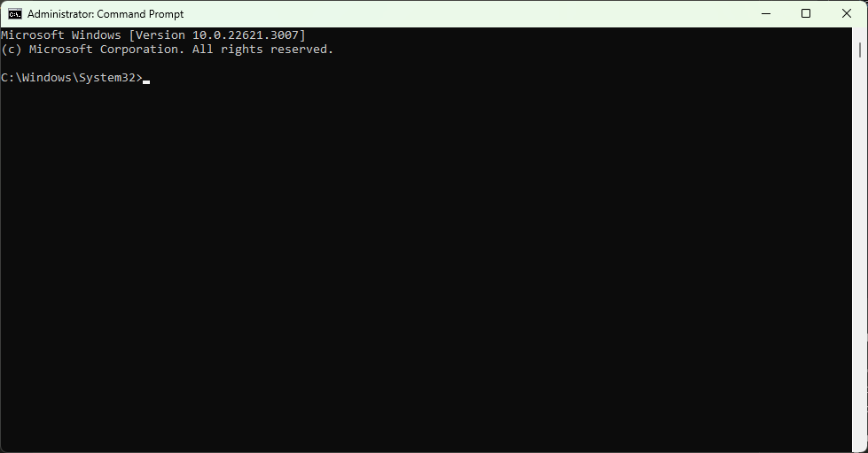

# **ALGOSUP Team 2**
### **Development team**
## **Functional Specification Document**
### **Unnamed for now**

### **DOCUMENT VERSION 0.1**

**01/22/2024**


**AUTHORS**

|**Name**|**Role**|
| :-: | :-: |
|DESPAUX Guillaume|Program Manager|


**DOCUMENT HISTORY**

|**Date**|**Version**|**Document Revision Description**|**Document Author**|
| :-: | :-: | :-: | :-: |
|1/22/2024|0.1|?|DESPAUX Guillaume|
|1/23/2024|0.2|?|DESPAUX Guillaume|
|1/24/2024|0.3|?|DESPAUX Guillaume|
|||||
|||||


**APPROVALS**

|**Approval Date**|**Approved Version**|**Approver Role**|**Approver**|
| :-: | :-: | :-: | :-: |
|?|0.1|QA?PM?||
|||||
|||||
|||||

- [**Table of Contents**](#table-of-content)
- [1. Introduction](#1-introduction)
   - [1.1   Purpose of the document](#11-purpose-of-the-document)
   - [1.2	Project Scope](#12-project-scope)
   - [1.3	Scope of the document](#13-scope-of-the-document)
   - [1.4 	Related documents](#14-related-documents)
   - [1.5   Glossary](#15-glossary)
   - [1.6   Risks and Assumptions](#16-risks-and-assumptions)
- [2.	System/Solution Overview](#2-system-solution-overview)
   - [2.1   Context Diagram/ Interface Diagram/ Data Flow Diagram, Application Screen Flow, Sitemap, Process Flow](#21-context-diagram-interface-diagram-data-flow-diagram-application-screen-flow-sitemap-process-flow)
   - [2.2   System Actors](#22-system-actors)
   - [2.3  Dependencies and Change Impacts](#23-dependencies-and-change-impacts)
- [3.	Functional Specifications](#3-functional-specifications)
   - [3.1 Title](#31-title)
      - [3.1.1 Purpose/ Description](#311-purpose-description)
      - [3.1.2 Use case](#312-use-case)
      - [3.1.3 Mockup](#313-mock-up)
      - [3.1.4 Functional Requirement](#314-functional-requirements)
      - [3.1.5 Field-level specification](#315-field-level-specifications)
- [5.	System Configurations](#4-system-configurations)
- [5.	Other System Requirements/ Non-Functional Requirements](#5-other-system-requirements-non-functional-requirements)
- [6.	Reporting Requirements](#6-reporting-requirements)
- [7.	Integration Requirements](#7-integration-requirements)
   - [7.1	Exception Handling/ Error Reporting](#71-exception-handling-error-reporting)
- [8.	Data Migration/ Conversion Requirements](#8-data-migration-conversion-requirements)
   - [8.1	Data Conversion Strategy](#81-data-conversion-strategy)
   - [8.2	Data Conversion Preparation](#82-data-conversion-preparation)
   - [8.3	Data Conversion Specifications](#83-data-conversion-specifications)
- [9.	References](#9-references)
- [10.	Open Issues](#10-open-issues)
- [11. Appendix](#11-appendix)
- [11.1 Assembly Language](#111-assembly-language)


# **1. Introduction**

The goal of the project is to create a virtual processor and an interpreter for running assembly code on that processor. We need to create our [assembly language](#112-assembly-language), create a [C](#15-glossary) program using [C standard libraries](#15-glossary) that can read text files(*.txt or can be something else?*), detect semantic and syntactical errors. We also need to implement a virtual system displaying text in a virtual terminal, that can be accessed from the assembly code.

## **1.1 Purpose of the document**

The Functional Specification Document is a document that provides detailed information on *how* the system solution will function and the requested behavior.  This document is created based on the high-level requirements identified in the Business Requirements Document and provides traceability on the functional specifications back to the business requirements.  Included in this document will be the detailed functional requirements including use cases, system inputs and outputs, process flows, diagrams, and mock-ups.

## **1.2 Project Scope**
1. The main goal is to develop a more understandable version of assembly, along with an interpreter capable of reading and compiling these files. The compiled code can then be run on an emulated old mobile phone, providing users with an extended range of functionalities.

     - We aim to enhance the functionality of old classic phones by providing developers with the opportunity to create new applications or games for these vintage mobile devices. 
     - Our objective is to offer a new way of using a compact phone primarily for calls and texts, while also allowing it to serve as a simple entertainment device for moments such as waiting in queues or sitting in waiting rooms. 
     - We intend to promote balanced usage, avoid smartphone addiction, and revitalize the appeal of old consoles and flip phones by introducing additional utilities.

2. We have outlined certain out-of-scope features designed to assist developers and clients in comprehending the product's capabilities:
 
   - Implementation of a debugger, facilitating a clear understanding of program execution and helping in comprehending how the Virtual Processor interprets the language.
   - Creation of a basic application, such as a Snake Game, to showcase how our language can enhance the capabilities of the overall phone.

## **1.3 	Related documents**
Add any related documentation that is relevant and related to the FSD. Some examples are the Project Charter, etc...

|**Component**|**Name**|**Description**|
| :- | :- | :- |
|Documentation|[Minutes of Meeting](../communications/minutes_of_meeting_01_16_2025.pdf)|This documents serve as project charter of the project|

## **1.4      Risks and Assumptions**
List any assumed factors and identified risks that could affect the functional design of the system.  Included can be third-party or commercial components that will be used, issues around the operating environment, or any constraints.

### Risks

- **Technical challenges:**

  - Unforeseen technical challenges in the virtual processor functioning.
  - Interpreter compilation or other development aspects may lead to delays or difficulties in achieving the desired functionality.
  
- **Resource constraints:**

   - Unexpected shortages or constraints in resources, including human resources or software tools, may impact the project's ability to meet deadlines or maintain quality standards.
   - *The documentation of AT2 should be complete enought.*
  
- **Unpredictable technical issues:**

   - Unpredictable technical issues, such as compatibility problems on different systems or devices, may arise during the testing phase.

### Assumptions

- **Technical expertise:**

  - The development team possesses the necessary technical expertise in assembly language, C language and parser to successfully create it.
  - The team has done a lot of research based on virtual processor functioning and architecture.
  
- **User engagement:**

  - There is an assumption that users will engage positively with our own assembly language, fostering community participation for use it and potential future enhancements.

- **Timely completion:**

  - The project assumes that it will be completed within the specified timeline, avoiding significant delays or disruptions.
  
- **Quality assurance:**

  - The testing and quality assurance processes will effectively identify and address any bugs or issues, ensuring a polished and functional virtual processor with our language and our interpreter.

### Constraints

- **Technical constraints**
   - The software needs to be run in an environment of 16 bits minimum.
   - The software needs to have at least 4 Ko minimum.  

## **1.6     Glossary** 
State any terms and their definitions that are described in the functional specifications. Include any acronyms that are mentioned in the document.

|**Term/Acronym**|**Definition**|**Description**|
| :- | :- | :- |
|C|C is an imperative procedural language, supporting structured programming, lexical variable scope, and recursion, with a static type system|It is referred to as a low-level language in the sense that each instruction in the language is designed to be compiled into a fairly predictable number of machine instructions|
|C standard librairies|The C standard library is a standardized collection of header files and library routines used to implement common operations|The C standard library provides macros, type definitions and functions for tasks such as string handling, mathematical computations, input/output processing, memory management, and several other operating system services.|
|Assembly Language|Assembly Language: Low-level programming language specific to a computer architecture.| A language who looks like Assembly but most easier to use and to understand created by ourself.|

# **2.  System/ Solution Overview**
__Provide a short description of the software and solution being specified and its purpose, including relevant benefits, objectives, and goals.__

## **2.1    Context Diagram/ Interface Diagram/ Data Flow Diagram, Application Screen Flow, Sitemap, Process Flow**
Provide any appropriate graphical representations that are relevant to the system and project such as a context/interface/data flow diagram, application screen flow, site map, or process flow.  Add as many as needed.

__NONE FOR NOW__

## **2.2     System Actors**

### **2.2.1     User Roles and Responsibilities**

--------------------------------------------------------------------------------------------------

|**User/Role**|**Example**|**Frequency of Use**|**Security/Access, Features Used**|**Additional Notes**|
| :-: | :-: | :-: | :-: | :-: |
|include the specified user/role such as Purchasing Manager, Dept Admin, Faculty, Student, etc|include examples of real people  in the role|describes how often they use the system. State Frequent, Occasional or Rare|describe the features of the system available for the role and any security/access permissions that should be stated|add any additional notes or supporting documentation as necessary|

## **2.3 Dependencies and Change Impacts**

### **2.3.1 System Dependencies**

|**System Name**|**Use Case/Utility**|**Description**|
| :-: | :-: | :-: |
|C Standard Libraries|Fundamental building blocks for C programs|Essential libraries that provide standard functions and macros for tasks such as input/output, string manipulation, memory management, and more.|
|g++|Compilation of C++ unit tests|The GNU C++ compiler, used for compiling programs written in C++.|
|gcc|Compilation of C programs|The GNU Compiler Collection, an optimizing compiler supporting various programming languages, hardware architectures, and operating systems.|
|CMake|Build automation and configuration|Handles aspects like cross-platform builds, system introspection, and user-customized builds. CMake is used for automation, testing, packaging, and installation of software in a compiler-independent manner.|
|Visual Studio Code|Multi-language code editor|A versatile code editor that supports coding in multiple programming languages. Visual Studio Code is free and helps users start coding quickly.|
|New Extension: .aop|Custom File Format|Represents files in a custom format used by the software application. The software should be able to read, write, and manipulate files with the .aop extension. Ensure that users are aware of this new extension and can associate it with the software application. Consider any additional dependencies related to the handling of this custom file format.|


### **2.3.2 Change Impacts**	

**C Standard Libraries:**
- **Impact:** Compatibility and Portability.
- **Details:** Any changes to the C Standard Libraries may affect the compatibility of existing C programs that rely on specific library functions. Developers need to ensure that the code remains portable across different systems.

**g++ (GNU C++ Compiler):**
- **Impact:** Unit Testing Framework Compatibility.
- **Details:** Updates or changes in the g++ compiler may impact the compatibility of C++ unit testing frameworks or the compilation process of existing test suites. Developers may need to update test configurations accordingly.

**gcc (GNU Compiler Collection):**
- **Impact:** Source Code Compatibility.
- **Details:** Changes in the behavior of the GCC compiler may impact the compilation of existing C programs. Developers should review and update source code if necessary to maintain compatibility.

**CMake:**
- **Impact:** Build System Configuration.
- **Details:** Any changes to CMake may impact the build configurations of the project. This includes adjustments for cross-platform builds, system introspection, or customized build settings. Developers need to update CMakeLists.txt files accordingly.

**Visual Studio Code:**
- **Impact:** Development Environment.
- **Details:** Updates or changes to Visual Studio Code may introduce new features, extensions, or changes in the user interface. This could impact the development environment and workflows of developers using Visual Studio Code.

**New File Extension (.aop):**
- **Impact:** File Handling and User Interaction.
- **Details:** The introduction of a new file extension "[.aop](#15-glossary)" implies that the software application needs to be capable of handling files in this custom format. Considerations include configuring the operating system for proper file associations, ensuring the software can read, files with the new extension, and communicating this change to users for proper interaction with the application.

# **3.   Functional Specifications**
   <!-- Start describing the specifications related to the overall system here. You may want to create a table/ index of all functionalities explained in the sections below and link them to the items below

If no separate reference/ traceability document is created for the project, use this section to map the business requirements, use cases, functional requirements and the test cases

Group your functional specifications as appropriate for your project. You may want to divide them by screens, functional areas, user role, JIRA tickets or high-level functions Vs detailed functions or any other way that works for your project -->

[Text file (.aop)](#31-input-file-aop)
   - Will contain all the AT2-Assembly Language code that is the basis for implementing new features.

[Interpreter (IAT2)](#41-interpreter)
   - Will be composed of three main parts:
      - The Parser will transform AT2-Assembly Language into a [data structure](#15-glossary) for the builder.
      - The Builder will rework the [data structure](#15-glossary) to make the program executable for the virtual processor.
      - The Virtual processor will run the program.

[Virtual Terminal](#51-interpreter)
   - Will display information about the program previously run in the given input file.

## **3.1 Text file (.aop)**

### **3.1.1 Purpose/ Description**
A text file.aop is a type of computer file that stores plain text data in a human-readable format.

### **3.1.2 Use case**

|**UC-1** |**Coding** |
| :-: | :-: |
|**Primary Actor(s)**|Software Developer|
|**Stakeholders and Interest**|Other stakeholders such as project managers and quality assurance team are interested in ensuring that the code meets requirements and quality standards.|
|**Trigger**|When a new feature or functionality needs to be implemented or existing code needs to be modified.|
|**Pre-conditions**|The developer has access to the development environment, necessary tools, and requirements/specifications for the code to be implemented.|
|**Post-conditions**|The code is successfully implemented, tested, and integrated into the existing system/repository.|
|**Main Success Scenario**|1. Developer reviews requirements and specifications. 2. Developer writes code according to the requirements. 3. Developer tests the code to ensure functionality and correctness.|
|**Extensions**|If code fails testing or review, developer makes necessary corrections and repeats testing/review process until successful.|
|**Priority**|High|
|**Special Requirements**|Version control system for code management, development environment with necessary software and libraries, code review process, testing frameworks/tools.|

### **3.1.3 Mock-up**
```aop
===================================
      Example TextFile.aop
===================================

MOV 1, 4
+ 4, 4   // + = mnemonic ADD from AT2-Assembly Language

===================================
   End of Example TextFile.aop
===================================
```

### **3.1.4  Functional Requirements**

1. **Creation and Editing**:<br>
Users should be able to create new text files and edit existing ones using appropriate text editing software.

2. **Text Entry**:<br>
Users should be able to enter, modify, and delete text within the text file using keyboard input or other input methods.

3. **Saving and Loading**:<br>
Users should be able to save their changes to the text file, and the file should be loadable for viewing and further editing.

4. **Undo and Redo**:<br>
Users should be able to undo and redo their actions within the text file to revert changes or repeat previous actions.

5. **File Management**:<br>
Users should be able to perform basic file management tasks such as renaming, copying, moving, and deleting text files.

6. **Compatibility**:<br>
The text file should be compatible with various text editing software and operating systems to ensure interoperability.

## **4.1 Interpreter**

### **4.1.1 Purpose/ Description**
An interpreter is a type of software program that reads and executes code written line by line, without the need for prior compilation into machine code. It interprets the code instructions directly into machine-readable instructions that the computer's processor can understand and execute.

### **4.1.2 Use case**
1. Read file.aop
2. Transform content
3. Run the program

|**UC-1** |**Read file.aop** |
| :-: | :-: |
|**Primary Actor(s)**|Parser, Interpreter|
|**Stakeholders and Interest**|Other stakeholders such as developers, system administrators, and end-users are interested in ensuring that the file can be read and processed correctly.|
|**Trigger**|When the user or system attempts to open and read a file with the ".aop" extension.|
|**Pre-conditions**|The file with the ".aop" extension exists and is accessible by the file reader or interpreter.|
|**Post-conditions**|The content of the ".aop" file is successfully read and processed by the file reader.|
|**Main Success Scenario**|1. The user or system attempts to open the ".aop" file using the appropriate software. 2. The file reader or interpreter reads the content of the file line by line. 3. The file reader or interpreter processes each line according to the syntax and semantics of the ".aop" file format. 4. The file reader or interpreter successfully completes reading and processing the entire file.|
|**Extensions**|If the file is not found or inaccessible, an error message is displayed, and the use case terminates. If the file format is invalid or contains errors, the file reader or interpreter may display an error message and halt processing.|
|**Priority**|Medium|
|**Special Requirements**|The file reader or interpreter must support the ".aop" file format and be capable of interpreting the syntax and semantics defined by the language or specification associated with the ".aop" extension.|

|**UC-2** |**Transform content**|
| :-: | :-: |
|**Primary Actor(s)**|Builder, Interpreter|
|**Stakeholders and Interest**|Other stakeholders such as developers, system administrators, and end-users are interested in ensuring that the file can be read and processed correctly.|
|**Trigger**|When the builder receives a request or instruction to transform content from the Parser|
|**Pre-conditions**|The builder is initialized and ready to transform code.|
|**Post-conditions**|The transformed code is send to the Virutal Processor|
|**Main Success Scenario**||
|**Extensions**|If the transformation instruction or function call is invalid or contains errors, the interpreter may throw an exception or error message and halt the interpretation process.|
|**Priority**|Medium|
|**Special Requirements**|The interpreter must support the specific transformation instructions or functions defined within the interpreted code.|

|**UC-3** |**Run the program**|
| :-: | :-: |
|**Primary Actor(s)**|Virtual Processor, Interpreter|
|**Stakeholders and Interest**|Other stakeholders such as developers, system administrators, and end-users are interested in ensuring that the file can be read and processed correctly.|
|**Trigger**|When the builder have finish all transformation|
|**Pre-conditions**|The builder is initialized and ready to run code.|
|**Post-conditions**|The program is successfully executed by the virtual processor, and the expected results are produced as a result of the execution.|
|**Main Success Scenario**||
|**Extensions**|If the program contains errors or invalid instructions, the interpreter may throw an exception or error message and halt the execution process. If the program execution exceeds specified resource limits, the interpreter may terminate the execution and report an error.|
|**Priority**|High|
|**Special Requirements**|The interpreter must support the specific programming language or instruction set defined within the interpreted code.|


### **4.1.3 Mock-up**
**Interpreter composition**


### **4.1.4  Functional Requirements**

1. **Parsing and Lexical Analysis**:<br>
The interpreter should be able to parse and analyze the syntax and structure of the input code written in the specified programming language.

2. **Execution of Code**:<br>
The interpreter should be capable of executing the parsed code instructions according to the semantics and rules defined by the programming language.

3. **Error Handling**:<br>
The interpreter should detect and handle errors in the input code, providing informative error messages to aid in debugging and troubleshooting.

4. **Data Types and Operations**:<br>
The interpreter should support various data types (e.g., integers, floating-point numbers, strings) and operations (e.g., arithmetic, logical, relational) defined by the programming language.

5. **Control Flow**:<br>
The interpreter should support control flow statements such as conditionals (if-else), loops (for, while), and branches to control the flow of execution within the code.

6. **Variable Declaration and Scope**:<br>
The interpreter should handle variable declaration, initialization, and scoping rules as defined by the programming language.

7. **Input and Output**:<br>
The interpreter should support input/output operations (e.g., reading from and writing to files, console input/output) as required by the programming language.

8. **Performance Optimization**:<br>
The interpreter should optimize code execution performance where possible, minimizing overhead and maximizing efficiency.

9. **Security**:<br>
The interpreter should implement security measures to prevent code buffer overflows and other security vulnerabilities.


## **5.1 Virtual Terminal**

### **5.1.1 Purpose/ Description**
A text file virtual terminal is a software tool or environment that provides a text-based interface for interacting with text files stored on a computer system. It allows users to view, edit, and manipulate the contents of text files using text-based commands or applications within a virtual terminal environment.

### **5.1.2 Use case**
1. Command-Line Interface (CLI)
2. Programming and Development
3. Text-Based Applications
4. Automation and Scripting
5. Legacy System Access ????????

|**UC-1** |**Command-Line Interface (CLI)** |
| :-: | :-: |
|**Primary Actor(s)**|End User, Developer|
|**Stakeholders and Interest**|Other stakeholders such as software developers and end-users are interested in efficiently interacting with the computer system through the command-line interface for various tasks and operations.|
|**Trigger**|User initiates a request to access the command-line interface for executing commands and performing tasks.|
|**Pre-conditions**|The computer system is operational, and the user has the necessary credentials to access the command-line interface.|
|**Post-conditions**|The user has successfully executed the desired commands in the command-line interface, and the system may have undergone changes or performed specific tasks based on the commands.|
|**Main Success Scenario**|1. User logs in to the system. 2. User navigates to the command-line interface. 3. User enters command(s) to perform a specific task. 4. The system processes the commands and executes the requested task. 5. The command-line interface displays the results of the executed commands.|
|**Extensions**|If the user enters an invalid command, the system provides an error message, and the user may need to re-enter a valid command.|
|**Priority**|High|
|**Special Requirements**|The command-line interface must support a variety of commands for system management, file manipulation, and other tasks.|

|**UC-2** |**Programming and Development** |
| :-: | :-: |
|**Primary Actor(s)**|Software Developer|
|**Stakeholders and Interest**|Developers and stakeholders interested in the development, testing, and debugging of software applications using a virtual terminal environment.|
|**Trigger**|Developer initiates a request to use the virtual terminal for programming and development tasks, such as coding, compiling, and debugging.|
|**Pre-conditions**|Developer has access to the virtual terminal environment and necessary permissions to perform programming and development tasks.|
|**Post-conditions**|Developer has completed programming and development tasks within the virtual terminal environment, including coding, compiling, and debugging software applications.|
|**Main Success Scenario**||
|**Extensions**|If the source code contains syntax errors or logical bugs, the developer may need to debug and fix the issues iteratively until the code compiles and runs without errors.|
|**Priority**|High|
|**Special Requirements**|The virtual terminal should provide efficient text-based editors and compilers tools to facilitate coding and development tasks.|

|**UC-3** |**Text-Based Applications** |
| :-: | :-: |
|**Primary Actor(s)**|User|
|**Stakeholders and Interest**|Users interested in using text-based applications within a virtual terminal environment for various tasks such as text editing, email communication, and web browsing.|
|**Trigger**|User initiates a request to access and use text-based applications within the virtual terminal environment.|
|**Pre-conditions**|The virtual terminal environment is operational and accessible to the user. Text-based applications are installed and available within the virtual terminal environment.|
|**Post-conditions**|The user has successfully used text-based applications within the virtual terminal environment to perform desired tasks such as editing text files.|
|**Main Success Scenario**|1. User logs in to the system. 2. User navigates to the command-line interface. 3. User enters command(s) to perform a specific task. 4. The system processes the commands and executes the requested task. 5. The command-line interface displays the results of the executed commands.|
|**Extensions**| If the user encounters errors or issues while using the text-based application, they may need to troubleshoot or seek assistance to resolve the issues.|
|**Priority**|Low|
|**Special Requirements**|The virtual terminal environment should provide a variety of text-based applications commonly used for tasks such as text editing.|

|**UC-4** |**Automation and Scripting** |
| :-: | :-: |
|**Primary Actor(s)**|System Administrator, Developer, Automated System|
|**Stakeholders and Interest**|Users, administrators, and automated systems interested in automating tasks and performing scripting operations within the virtual terminal environment.|
|**Trigger**|System administrator, developer, or automated system initiates a request to automate tasks or perform scripting operations within the virtual terminal environment.|
|**Pre-conditions**|The virtual terminal environment is operational and accessible. Required scripting languages and automation tools are installed and available within the virtual terminal environment.|
|**Post-conditions**|The tasks are successfully automated, and scripting operations are executed within the virtual terminal environment, resulting in the desired outcomes or actions.|
|**Main Success Scenario**|1. Actor accesses the virtual terminal environment. 2. Actor writes or modifies scripts using scripting languages within the virtual terminal environment to automate tasks or perform specific actions. 3. Actor executes the scripts, triggering the automation of tasks or execution of scripting operations. 4. The virtual terminal environment processes the scripts and performs the specified actions or tasks automatically. 5. The desired outcomes or actions are achieved successfully.|
|**Extensions**|If the scripts contain errors or encounter issues during execution, the actor may need to troubleshoot the scripts and revise them accordingly.|
|**Priority**|High|
|**Special Requirements**|Security measures should be implemented to ensure the safety and integrity of automated tasks and scripting operations within the virtual terminal environment.|


### **5.1.3 Mock-up**
**Virtual Terminal**


### **5.1.4  Functional Requirements**

1. **User Interface**:<br>
Provide a text-based interface for interacting with the system.
Display text output from the system.
Accept text input from the user.

2. **Terminal Emulation**:<br>
Emulate the behavior of physical terminals (e.g., DEC VT100, ANSI).
Support terminal control sequences for cursor movement, text formatting, and other display control features.

3. **Scrolling and Paging**:<br>
Provide scrolling functionality to view previous output.
Support paging for long text output, allowing users to navigate through large amounts of text.

4. **Compatibility**:<br>
Ensure compatibility with a wide range of operating systems and platforms.

5. **Accessibility**:<br>
Provide accessibility features for users with disabilities, such as screen readers and keyboard navigation support.

6. **Security**:<br>
Implement security measures to protect terminal sessions and prevent unauthorized access.


# **6.   System Configurations**
   Provide an overview of all the steps or the set ups required to configure an application/program. Also state the intent or purpose behind each set up or configuration. Discuss the possible alternatives, customizations, workaround’s, conditions and dependencies in a particular configuration. In case of Oracle applications, please list all applicable BR100’s or Application set up documents

# **7.   Other System Requirements/ Non-Functional Requirements**
   *This section is used in contrast with stated functional requirements to highlight the additional details on the quality related aspects as well as other behavioral aspects of a system. This section is used to capture the stakeholders’ implicit expectations about how well the system will work under a given circumstance. Here you can  state the specific SLA’s related to system response times (Data search and retrieval), Performance needs and metrics, Latencies in a particular timeframe or during high volume transactions, System failures and recovery management, Security levels and accessibility constraints, Data Backup and archiving Capabilities, Legal compliance needs etc. The broader definition of the term ‘system’ also includes integrations with all types of Mobile platforms, Mobile devices, Tablets and Smart phones. 

# **8.   Reporting Requirements**
   *This section is used to capture the reporting needs, including but not limited to the scope and format of the report, data elements and contents required on the report, file types and extraction mechanisms, user base and accessibility levels, frequency of report extractions etc. Also provide the mock up of the report if needed.  If necessary, create a separate document for reporting requirements. 

# **9.   Integration Requirements**
   Identify the integration needs and state all required interfaces with anything external to this solution including hardware, software, and users. Include Architectural overview diagrams, high level data flow diagrams, table structures and schema, interface protocols, API’s, Error conditions, Error validations and messaging needs, Auto processing requirements etc. You can optionally state hardware and software dependencies, Upgrade requirements, compatibility issues with existing frameworks and solutions, etc

(Data Flow Diagrams, Interface Diagrams – if necessary)

## **9.1  Exception Handling/ Error Reporting**
This is where you can explain the error conditions/Exceptions that normally happen in Interfaces or cross flow system integrations. Explain the nature of exception, Error Id, Root cause of the error and also the strategy to handle the scenario. You can also indicate if there are any concurrent programs designed to automatically handle the error records or error conditions. State if there are any error reports generated or notifications utilized to alarm the support teams and system Administrators during the interface failures or outages


|**Exception/ Error ID**|**Error**|**Cause**|**Solution Strategy**|
| :-: | :-: | :-: | :-: |
|||||


# **10.   References**
   List all references to external material used as background information or knowledge for the FSD. Examples may include a compliancy website, Stanford website, etc

# **11.  Open Issues**

|**Issue ID**|**Issue**|**Raised By**|**Raised On**|**Solution/ Decision**|**Resolved By**|**Resolved On**|**Status**|
| :-: | :-: | :-: | :-: | :-: | :-: | :-: | :-: |
|||||||||
# **12.  Appendix**
## **12.1 ASSEMBLY LANGUAGE**
January 22, 2024


