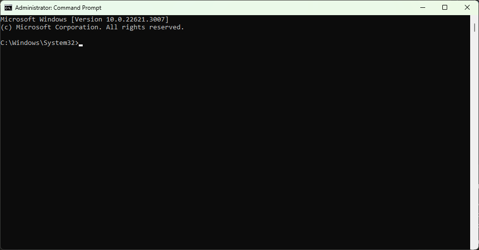

# **ALGOSUP Team 2**
## **Functional Specification Document**

### **DOCUMENT VERSION 0.4.2**

**01/22/2024**


**AUTHORS**

|     **Name**      |    **Role**     |
| :---------------: | :-------------: |
| DESPAUX Guillaume | Program Manager |


**DOCUMENT HISTORY**

| **Date**  | **Version** |  **Reviewer**   | **Document Author** |
| :-------: | :---------: | :-------------: | :-----------------: |
| 1/22/2024 |     0.1     | GUILLOUCHE Enzo |  DESPAUX Guillaume  |
| 1/23/2024 |     0.2     | GUILLOUCHE Enzo |  DESPAUX Guillaume  |
| 1/24/2024 |     0.3     | GUILLOUCHE Enzo |  DESPAUX Guillaume  |
| 1/25/2024 |     0.4     | GUILLOUCHE Enzo |  DESPAUX Guillaume  |
| 1/26/2024 |    0.4.1    | GUILLOUCHE Enzo |  DESPAUX Guillaume  |
| 1/26/2024 |    0.4.2    | GUILLOUCHE Enzo |  DESPAUX Guillaume  |
|           |             |                 |                     |

**APPROVALS**

| **Approval Date** | **Approved Version** | **Approver Role** |   **Approver**    |
| :---------------: | :------------------: | :---------------: | :---------------: |
|     1/30/2024     |         0.1          |       ProgM       | DESPAUX Guillaume |
|     1/30/2024     |         0.1          |        QA         |  GUILLOUCHE Enzo  |
|     1/30/2024     |         0.1          |        PM         | GAGNEPAIN Mathias |
|                   |                      |                   |                   |

<details>
<summary>Table of Contents</summary>

 - [1. Introduction](#1-introduction)
   - [1.1 Purpose of the document](#11-purpose-of-the-document)
   - [1.2 Project Scope](#12-project-scope)
   - [1.3 Out of Scope](#13-out-of-scope)
      - [1.3.1 Facilities](#131-facilities)
      - [1.3.2 Code Structure](#132-code-structure)
   - [1.4 Related documents](#14-related-documents)
   - [1.5 Risks and Assumptions](#15-risks-and-assumptions)
 - [2. System/ Solution Overview](#2-system-solution-overview)
   - [2.1 System Actors](#21-system-actors)
      - [2.1.1 User Roles and Responsibilities](#211-user-roles-and-responsibilities)
   - [2.2 Dependencies and Change Impacts](#22-dependencies-and-change-impacts)
      - [2.2.1 System Dependencies](#221-system-dependencies)
      - [2.2.2 Change Impacts](#222-change-impacts)
 - [3. Functional Specifications](#3-functional-specifications)
   - [3.1 Text file .aop](#31-text-file-aop)
      - [3.1.1 Purpose/ Description](#311-purpose-description)
      - [3.1.2 Use case](#312-use-case)
      - [3.1.3 Mock-up](#313-mock-up)
      - [3.1.4 Functional Requirements](#314-functional-requirements)
   - [4.1 Interpreter](#41-interpreter)
      - [4.1.1 Purpose/ Description](#411-purpose-description)
      - [4.1.2 Use case](#412-use-case)
      - [4.1.3 Mock-up](#413-mock-up)
      - [4.1.4 Functional Requirements](#414-functional-requirements)
   - [5.1 Virtual Terminal](#51-virtual-terminal)
      - [5.1.1 Purpose/ Description](#511-purpose-description)
      - [5.1.2 Use case](#512-use-case)
      - [5.1.3 Mock-up](#513-mock-up)
      - [5.1.4 Functional Requirements](#514-functional-requirements)
 - [6. System Configurations](#6-system-configurations)
   - [6.1 Minimum requirements](#61-minimum-requirements)
   - [6.2 Installation](#62-installation)
 - [7. Other System Requirements/ Non-Functional Requirements](#7-other-system-requirements-non-functional-requirements)
 - [8. Reporting Requirements](#8-reporting-requirements)
 - [9. Integration Requirements](#9-integration-requirements)
   - [9.1 Exception Handling/ Error Reporting](#91-exception-handling-error-reporting)
 - [10. References](#10-references)
 - [11 Glossary](#11-glossary)
 - [12. Appendix](#12-appendix)
   - [12.1 ASSEMBLY LANGUAGE](#121-assembly-language)
</details>

# **1. Introduction**
The goal of the project is to create a [Virtual Processor](#11-glossary) and an [Interpreter](#11-glossary) for running assembly code on that processor. We need to create our [Assembly Language](#112-assembly-language), create a [C](#15-glossary) program using [C Standard Libraries](#15-glossary) that can read text files, detect semantic and syntactical errors. We also need to implement a virtual system displaying text in a [Virtual Terminal](#11-glossary), that can be accessed from the assembly code.

## **1.1 Purpose of the document**
The Functional Specification Document is a document that provides detailed information. This document is created based on the high-level requirements identified in the Call For Tender and provides traceability on the functional specifications. Included in this document will be the detailed functional requirements including use cases, system inputs and outputs, process flows, diagrams, and mock-ups.

## **1.2 Project Scope**
The main goal is to create our own [Assembly Language](#11-glossary), which would be more understandable, readable, and easier to use than traditional Assembly Languages.
 Moreover, also creates an [Interpreter](#11-glossary) capable of reading and compiling these files. The compiled code can then be run on emulated small and limited devices, providing an extended range of functionalities for users.

   - Creation of a specialized [Assembly Language](#11-glossary) for small devices with a limited amount of capacities.
   - Creation of an [Interpreter](#11-glossary) which will be able to run the code provided in our new language. 

## **1.3 Out of Scope** 
### **1.3.1 Facilities**
We have outlined certain out-of-scope features designed to assist developers and clients in comprehending the product's amelioration:
 
   - Implementation of a [Debugger](#11-glossary), facilitating a clear understanding of program execution and helping in comprehending how the [Virtual Processor](#11-glossary) interprets the language.
   - The implementation of a verbose mode which gives more information when the code is running.
   
### **1.3.2 Code Structure**
- In the future, we aim to create an [Assembler](#11-glossary) system that would give more efficiency for the program execution. 

## **1.4 Related documents**

| **Component** | **Name**                                                                  | **Description**                                         |
| :------------ | :------------------------------------------------------------------------ | :------------------------------------------------------ |
| Documentation | [Minutes of Meeting](../communications/minutes_of_meeting_01_16_2025.pdf) | This documents serve as project charter for the project |

## **1.5 Risks and Assumptions**
### Risks
- **Technical challenges:**
  - Unforeseen technical challenges in the [Virtual Processor](#11-glossary) functioning.
  - Achieving the project in time without delays, developing the desired functionalities.

- **Resource constraints:**
   - Unexpected shortages or constraints in resources, including human resources or software tools, may impact the project's ability to meet deadlines or maintain quality standards.
   - The documentation of [AT2](#11-glossary) should be complete enough.
  
- **Unpredictable technical issues:**
   - Unpredictable technical issues, such as compatibility problems on different systems or devices, may arise during the testing phase.

### Assumptions
- **Technical expertise:**
  - The development team possesses the necessary technical expertise in [Assembly Language](#11-glossary), [C](#11-glossary) language and Parser to successfully create it.
  - The team has done a lot of research based on [Virtual Processor](#11-glossary) functioning and architecture.
  
- **User engagement:**
  - Users will engage positively with our own [Assembly Language](#11-glossary), fostering community participation for its use it and potential future enhancements.

- **Timely completion:**
  - The project assumes that it will be completed within the specified timeline, avoiding significant delays or disruptions.
  
- **Quality assurance:**
  - The testing and quality assurance processes will effectively identify and address any bugs or issues, ensuring a polished and functional [Virtual Processor](#11-glossary) with our language and our [Interpreter](#11-glossary).

# **2. System/ Solution Overview**
Our system is made up of three parts, which are:
- The Parser
- The Builder
- The [Virtual Processor](#11-glossary)

## **2.1 System Actors**
### **2.1.1 User Roles and Responsibilities**

| **User/Role** |           **Example**           | **Frequency of Use** |                           **Features Used**                           |                       **Additional Notes**                        |
| :-----------: | :-----------------------------: | :------------------: | :-------------------------------------------------------------------: | :---------------------------------------------------------------: |
|  Developers   | Alex Johnson, Software Engineer |         Rare         | Want to update his own server to make it more efficient and optimized | add any additional notes or supporting documentation as necessary |
|  Student   | Chelseah Mehr, High School Student |         Rare         | Want to learn about programming languages and to be introduced to Assembly | add any additional notes or supporting documentation as necessary |
|  Administration | Richard Richards, System adminitrator |         Occasional         | Want to create dependencies to allow some developpers of his team to work with the [Virtual Processor](#11-glossary) | add any additional notes or supporting documentation as necessary |

## **2.2 Dependencies and Change Impacts**
### **2.2.1 System Dependencies**

|   **System Name**    |            **Use Case/Utility**            |                                                                                                                                                                        **Description**                                                                                                                                                                         |
| :------------------: | :----------------------------------------: | :------------------------------------------------------------------------------------------------------------------------------------------------------------------------------------------------------------------------------------------------------------------------------------------------------------------------------------------------------------: |
| [C Standard Libraries](#11-glossary) | Fundamental building blocks for [C](#11-glossary) programs |                                                                                                        Essential libraries that provide standard functions and macros for tasks such as input/output, string manipulation, memory management, and more.                                                                                                        |
|         g++          |       Compilation of C++ unit tests        |                                                                                                                                               The [GNU](#11-glossary) C++ [Compiler](#11-glossary), used for compiling programs written in C++.                                                                                                                                                |
|         gcc          |         Compilation of [C](#11-glossary) programs          |                                                                                                          The [GNU](#11-glossary) [Compiler](#11-glossary) Collection, an optimizing [Compiler](#11-glossary) supporting various programming languages, hardware architectures, and operating systems.                                                                                                          |
|        CMake         |     [Build](#11-glossary) automation and configuration     |                                                                         Handles aspects like cross-platform builds, system introspection, and user-customized builds. CMake is used for automation, testing, packaging, and installation of software in a [Compiler](#11-glossary)-independent manner.                                                                         |
|  Visual Studio Code  |         Multi-language code editor         |                                                                                                        A versatile code editor that supports coding in multiple programming languages. Visual Studio Code is free and helps users start coding quickly.                                                                                                        |
| New Extension: [.aop](#11-glossary)  |             Custom File Format             | Represents files in a custom format used by the software application. The software should be able to read, write, and manipulate files with the [.aop](#11-glossary) extension. Ensure that users are aware of this new extension and can associate it with the software application. Consider any additional dependencies related to the handling of this custom file format. |

### **2.2.2 Change Impacts**	
**C Standard Libraries:**
- **Impact:** Compatibility and Portability.
- **Details:** Any changes to the [C Standard Libraries](#11-glossary) may affect the compatibility of existing [C](#11-glossary) programs that rely on specific library functions. Developers need to ensure that the code remains portable across different systems.

**G++ (GNU C++ Compiler):**
- **Impact:** Unit Testing Framework Compatibility.
- **Details:** Updates or changes in the G++ [Compiler](#11-glossary) may impact the compatibility of C++ unit testing frameworks or the compilation process of existing test suites. Developers may need to update test configurations accordingly.

**GCC (GNU Compiler Collection):**
- **Impact:** Source Code Compatibility.
- **Details:** Changes in the behavior of the GCC [Compiler](#11-glossary) may impact the compilation of existing [C](#11-glossary) programs. Developers should review and update source code if necessary to maintain compatibility.

**CMake:**
- **Impact:** [Build](#11-glossary) System Configuration.
- **Details:** Any changes to CMake may impact the [Build](#11-glossary) configurations of the project. This includes adjustments for cross-platform builds, system introspection, or customized [Build](#11-glossary) settings. Developers need to update CMakeLists.txt files accordingly.

**Visual Studio Code:**
- **Impact:** Development Environment.
- **Details:** Updates or changes to Visual Studio Code may introduce new features, extensions, or changes in the user interface. This could impact the development environment and workflows of developers using Visual Studio Code.

**New File Extension ([.aop](#11-glossary)):**
- **Impact:** File Handling and User Interaction.
- **Details:** The introduction of a new file extension "[.aop](#11-glossary)" implies that the software application needs to be capable of handling files in this custom format. Considerations include configuring the operating system for proper file associations, ensuring the software can read, files with the new extension, and communicating this change to users for proper interaction with the application.

# **3. Functional Specifications**
Text file (.aop)
   - Will contain all the AT2 code that is the basis for implementing new features.

Interpreter ([IAT2](#11-glossary))
   - Will be composed of three main parts:
      - The Parser will transform AT2 into a [data structure](#15-glossary) for the Builder.
      - The Builder will rework the [data structure](#15-glossary) to make the program executable for the [Virtual Processor](#11-glossary).
      - The [Virtual Processor](#11-glossary) will run the program.

[Virtual Terminal](#11-glossary)
   - Will display information about the program previously run in the given input file.

## **3.1 Text file .aop**
### **3.1.1 Purpose/ Description**
A text file[.aop](#11-glossary) is a type of computer file that stores plain text data in a human-readable format.

### **3.1.2 Use case**
|           **UC-1**            |                                                                        **Coding**                                                                         |
| :---------------------------: | :-------------------------------------------------------------------------------------------------------------------------------------------------------: |
|     **Primary Actor(s)**      |                                                                    Software Developer                                                                     |
| **Stakeholders and Interest** | Other stakeholders such as project managers and quality assurance team are interested in ensuring that the code meets requirements and quality standards. |
|          **Trigger**          |                            When a new feature or functionality needs to be implemented or existing code needs to be modified.                             |
|      **Pre-conditions**       |         The developer has access to the development environment, necessary tools, and requirements/specifications for the code to be implemented.         |
|      **Post-conditions**      |                             The code is successfully implemented, tested, and integrated into the existing system/repository.                             |
|        **Extensions**         |                If code fails testing or review, developer makes necessary corrections and repeats testing/review process until successful.                |
|         **Priority**          |                                                                           High                                                                            |
|   **Special Requirements**    | Version control system for code management, development environment with necessary software and libraries, code review process, testing frameworks/tools. |

### **3.1.3 Mock-up**
```asm
===================================
      Example TextFile.asm
===================================

MOV [register], 1
ADD [register], 4


===================================
   End of Example TextFile.asm
===================================

            WILL BECOME
___________________________________
↓ ↓ ↓ ↓ ↓ ↓ ↓ ↓ ↓ ↓ ↓ ↓ ↓ ↓ ↓ ↓ ↓ ↓              
===================================
      Example TextFile.aop
===================================

mov [register], 1
+ [register], 4


===================================
   End of Example TextFile.aop
===================================
```

### **3.1.4 Functional Requirements**

- **Text Entry**:<br>
Users should be able to enter, modify, and delete text within the text file using keyboard input or other input methods.

- **Saving and Loading**:<br>
Users should be able to save their changes to the text file, and the file should be loadable for viewing and further editing.

- **Undo and Redo**:<br>
Users should be able to undo and redo their actions within the text file to revert changes or repeat previous actions.

- **File Management**:<br>
Users should be able to perform basic file management tasks such as renaming, copying, moving, and deleting text files.

- **Compatibility**:<br>
The text file should be compatible with various text editing software and operating systems to ensure interoperability.

## **4.1 Interpreter**

### **4.1.1 Purpose/ Description**
An [Interpreter](#11-glossary) is a type of software program that reads and executes code written line by line, without the need for prior compilation into machine code. It interprets the code instructions directly into machine-readable instructions that the computer's processor can understand and execute.

### **4.1.2 Use case**
1. Read file[.aop](#11-glossary)
2. Transform content
3. Run the program

|           **UC-1**            |                                                                                                            **Read file[.aop](#11-glossary)**                                                                                                             |
| :---------------------------: | :--------------------------------------------------------------------------------------------------------------------------------------------------------------------------------------------------------------------------------------: |
|     **Primary Actor(s)**      |                                                                                                           Parser, [Interpreter](#11-glossary)                                                                                                            |
| **Stakeholders and Interest** |                                        Other stakeholders such as developers, system administrators, and end-users are interested in ensuring that the file can be read and processed correctly.                                         |
|          **Trigger**          |                                                                           When the user or system attempts to open and read a file with the "[.aop](#11-glossary)" extension.                                                                            |
|      **Pre-conditions**       |                                                                      The file with the "[.aop](#11-glossary)" extension exists and is accessible by the file reader or [Interpreter](#11-glossary).                                                                      |
|      **Post-conditions**      |                                                                          The content of the "[.aop](#11-glossary)" file is successfully read and processed by the file reader.                                                                           |
|        **Extensions**         | If the file is not found or inaccessible, an error message is displayed, and the use case terminates. If the file format is invalid or contains errors, the file reader or [Interpreter](#11-glossary) may display an error message and halt processing. |
|         **Priority**          |                                                                                                                  Medium                                                                                                                  |
|   **Special Requirements**    |                The file reader or [Interpreter](#11-glossary) must support the "[.aop](#11-glossary)" file format and be capable of interpreting the syntax and semantics defined by the language or specification associated with the "[.aop](#11-glossary)" extension.                 |

|           **UC-2**            |                                                                             **Transform content**                                                                              |
| :---------------------------: | :----------------------------------------------------------------------------------------------------------------------------------------------------------------------------: |
|     **Primary Actor(s)**      |                                                                              Builder, [Interpreter](#11-glossary)                                                                              |
| **Stakeholders and Interest** |           Other stakeholders such as developers, system administrators, and end-users are interested in ensuring that the file can be read and processed correctly.            |
|          **Trigger**          |                                            When the Builder receives a request or instruction to transform content from the Parser                                             |
|      **Pre-conditions**       |                                                            The Builder is initialized and ready to transform code.                                                             |
|      **Post-conditions**      |                                                             The transformed code is send to the Virutal Processor                                                              |
|        **Extensions**         | If the transformation instruction or function call is invalid or contains errors, the [Interpreter](#11-glossary) may throw an exception or error message and halt the interpretation process. |
|         **Priority**          |                                                                                     Medium                                                                                     |
|   **Special Requirements**    |                            The [Interpreter](#11-glossary) must support the specific transformation instructions or functions defined within the interpreted code.                             |

|           **UC-3**            |                                                                                                                             **Run the program**                                                                                                                              |
| :---------------------------: | :--------------------------------------------------------------------------------------------------------------------------------------------------------------------------------------------------------------------------------------------------------------------------: |
|     **Primary Actor(s)**      |                                                                                                                        [Virtual Processor](#11-glossary), [Interpreter](#11-glossary)                                                                                                                        |
| **Stakeholders and Interest** |                                                          Other stakeholders such as developers, system administrators, and end-users are interested in ensuring that the file can be read and processed correctly.                                                           |
|          **Trigger**          |                                                                                                               When the Builder have finish all transformation                                                                                                                |
|      **Pre-conditions**       |                                                                                                              The Builder is initialized and ready to run code.                                                                                                               |
|      **Post-conditions**      |                                                                      The program is successfully executed by the [Virtual Processor](#11-glossary), and the expected results are produced as a result of the execution.                                                                      |
|        **Extensions**         | If the program contains errors or invalid instructions, the [Interpreter](#11-glossary) may throw an exception or error message and halt the execution process. If the program execution exceeds specified resource limits, the [Interpreter](#11-glossary) may terminate the execution and report an error. |
|         **Priority**          |                                                                                                                                     High                                                                                                                                     |
|   **Special Requirements**    |                                                                            The [Interpreter](#11-glossary) must support the specific programming language or instruction set defined within the interpreted code.                                                                            |


### **4.1.3 Mock-up**
**Interpreter composition**


### **4.1.4  Functional Requirements**

- **Parsing and Lexical Analysis**:<br>
The [Interpreter](#11-glossary) should be able to parse and analyze the syntax and structure of the input code written in the specified programming language.

- **Execution of Code**:<br>
The [Interpreter](#11-glossary) should be capable of executing the parsed code instructions according to the semantics and rules defined by the programming language.

- **Error Handling**:<br>
The [Interpreter](#11-glossary) should detect and handle errors in the input code, providing informative error messages to aid in debugging and troubleshooting.

- **Data Types and Operations**:<br>
The [Interpreter](#11-glossary) should support various data types (e.g., integers, floating-point numbers, strings) and operations (e.g., arithmetic, logical, relational) defined by the programming language.

- **Control Flow**:<br>
The [Interpreter](#11-glossary) should support control flow statements such as conditionals (if-else), loops (for, while), and branches to control the flow of execution within the code.

- **Variable Declaration and Scope**:<br>
The [Interpreter](#11-glossary) should handle variable declaration, initialization, and scoping rules as defined by the programming language.

- **Input and Output**:<br>
The [Interpreter](#11-glossary) should support input/output operations (e.g., reading from and writing to files, console input/output) as required by the programming language.

- **Performance Optimization**:<br>
The [Interpreter](#11-glossary) should optimize code execution performance where possible, minimizing overhead and maximizing efficiency.

- **Security**:<br>
The [Interpreter](#11-glossary) should implement security measures to prevent code buffer overflows and other security vulnerabilities.

## **5.1 Virtual Terminal**
### **5.1.1 Purpose/ Description**
A text file [Virtual Terminal](#11-glossary) is a software tool or environment that provides a text-based interface for interacting with text files stored on a computer system. It allows users to view, edit, and manipulate the contents of text files using text-based commands or applications within a [Virtual Terminal](#11-glossary) environment.

### **5.1.2 Use case**
1. Command-Line Interface (CLI)
2. Programming and Development
3. Automation and Scripting

|           **UC-1**            |                                                                                   **Command-Line Interface (CLI)**                                                                                   |
| :---------------------------: | :--------------------------------------------------------------------------------------------------------------------------------------------------------------------------------------------------: |
|     **Primary Actor(s)**      |                                                                                         End User, Developer                                                                                          |
| **Stakeholders and Interest** | Other stakeholders such as software developers and end-users are interested in efficiently interacting with the computer system through the command-line interface for various tasks and operations. |
|          **Trigger**          |                                              User initiates a request to access the command-line interface for executing commands and performing tasks.                                              |
|      **Pre-conditions**       |                                         The computer system is operational, and the user has the necessary credentials to access the command-line interface.                                         |
|      **Post-conditions**      |         The user has successfully executed the desired commands in the command-line interface, and the system may have undergone changes or performed specific tasks based on the commands.          |
|        **Extensions**         |                                   If the user enters an invalid command, the system provides an error message, and the user may need to re-enter a valid command.                                    |
|         **Priority**          |                                                                                                 High                                                                                                 |
|   **Special Requirements**    |                                       The command-line interface must support a variety of commands for system management, file manipulation, and other tasks.                                       |

|           **UC-2**            |                                                                      **Programming and Development**                                                                       |
| :---------------------------: | :------------------------------------------------------------------------------------------------------------------------------------------------------------------------: |
|     **Primary Actor(s)**      |                                                                             Software Developer                                                                             |
| **Stakeholders and Interest** |              Developers and stakeholders interested in the development, testing, and debugging of software applications using a [Virtual Terminal](#11-glossary) environment.              |
|          **Trigger**          |                 Developer initiates a request to use the [Virtual Terminal](#11-glossary) for programming and development tasks, such as coding, compiling, and debugging.                 |
|      **Pre-conditions**       |                      Developer has access to the [Virtual Terminal](#11-glossary) environment and necessary permissions to perform programming and development tasks.                      |
|      **Post-conditions**      |    Developer has completed programming and development tasks within the [Virtual Terminal](#11-glossary) environment, including coding, compiling, and debugging software applications.    |
|        **Extensions**         | If the source code contains syntax errors or logical bugs, the developer may need to debug and fix the issues iteratively until the code compiles and runs without errors. |
|         **Priority**          |                                                                                    High                                                                                    |
|   **Special Requirements**    |                      The [Virtual Terminal](#11-glossary) should provide efficient text-based editors and compilers tools to facilitate coding and development tasks.                      |

|           **UC-3**            |                                                                              **Automation and Scripting**                                                                              |
| :---------------------------: | :------------------------------------------------------------------------------------------------------------------------------------------------------------------------------------: |
|     **Primary Actor(s)**      |                                                                   System Administrator, Developer, Automated System                                                                    |
| **Stakeholders and Interest** |                Users, administrators, and automated systems interested in automating tasks and performing scripting operations within the [Virtual Terminal](#11-glossary) environment.                |
|          **Trigger**          |          System administrator, developer, or automated system initiates a request to automate tasks or perform scripting operations within the [Virtual Terminal](#11-glossary) environment.           |
|      **Pre-conditions**       | The [Virtual Terminal](#11-glossary) environment is operational and accessible. Required scripting languages and automation tools are installed and available within the [Virtual Terminal](#11-glossary) environment. |
|      **Post-conditions**      |           The tasks are successfully automated, and scripting operations are executed within the [Virtual Terminal](#11-glossary) environment, resulting in the desired outcomes or actions.           |
|        **Extensions**         |                    If the scripts contain errors or encounter issues during execution, the actor may need to troubleshoot the scripts and revise them accordingly.                     |
|         **Priority**          |                                                                                          High                                                                                          |
|   **Special Requirements**    |            Security measures should be implemented to ensure the safety and integrity of automated tasks and scripting operations within the [Virtual Terminal](#11-glossary) environment.             |

<!-- I think there are too much use cases for too specific features. Perhaps there should be more general ones. -->


### **5.1.3 Mock-up**
**Virtual Terminal**


### **5.1.4  Functional Requirements**

- **User Interface**:<br>
Provide a text-based interface for interacting with the system.
Display text output from the system.
Accept text input from the user.

- **Terminal Emulation**:<br>
Emulate the behavior of physical terminals (e.g., DEC VT100, ANSI).
Support terminal control sequences for cursor movement, text formatting, and other display control features.

- **Scrolling and Paging**:<br>
Provide scrolling functionality to view previous output.
Support paging for long text output, allowing users to navigate through large amounts of text.

- **Compatibility**:<br>
Ensure compatibility with a wide range of operating systems and platforms.

- **Accessibility**:<br>
Provide accessibility features for users with disabilities, such as screen readers and keyboard navigation support.

- **Security**:<br>
Implement security measures to protect terminal sessions and prevent unauthorized access.

# **6. System Configurations**
## **6.1 Minimum requirements**
   - CPU : [16 Bits Environment](#11-glossary)
   - [RAM](#11-glossary) : 32 [Kilobytes](#11-glossary)
## **6.2 Installation**

# **7. Other System Requirements/ Non-Functional Requirements**
   *This section is used in contrast with stated functional requirements to highlight the additional details on the quality related aspects as well as other behavioral aspects of a system. This section is used to capture the stakeholders’ implicit expectations about how well the system will work under a given circumstance. Here you can  state the specific SLA’s related to system response times (Data search and retrieval), Performance needs and metrics, Latencies in a particular timeframe or during high volume transactions, System failures and recovery management, Security levels and accessibility constraints, Data Backup and archiving Capabilities, Legal compliance needs etc. The broader definition of the term ‘system’ also includes integrations with all types of Mobile platforms, Mobile devices, Tablets and Smart phones. 

# **8. Reporting Requirements**
   *This section is used to capture the reporting needs, including but not limited to the scope and format of the report, data elements and contents required on the report, file types and extraction mechanisms, user base and accessibility levels, frequency of report extractions etc. Also provide the mock up of the report if needed.  If necessary, create a separate document for reporting requirements. 

# **9. Integration Requirements**
   Identify the integration needs and state all required interfaces with anything external to this solution including hardware, software, and users. Include Architectural overview diagrams, high level data flow diagrams, table structures and schema, interface protocols, API’s, Error conditions, Error validations and messaging needs, Auto processing requirements etc. You can optionally state hardware and software dependencies, Upgrade requirements, compatibility issues with existing frameworks and solutions, etc

(Data Flow Diagrams, Interface Diagrams – if necessary)

## **9.1  Exception Handling/ Error Reporting**

| **Exception/ Error ID** |           **Error**            |                                                                                          **Cause**                                                                                           |                   **Solution Strategy**                    |
| :---------------------: | :----------------------------: | :------------------------------------------------------------------------------------------------------------------------------------------------------------------------------------------: | :--------------------------------------------------------: |
|           101           |             ERROR:             |                                                                        User error, invoked with the ERROR directive.                                                                         |                            None                            |
|           102           |       Cannot open file.        |                           Could not open a file. If it is a source file, the file may not exist. If it is an output file, the old version may be write protected.                            |      Check if the file exist, you used the right name      |
|           103           |       Illegal character.       | An illegal character in a label. Valid characters for labels are alphabetic (a..f, A..F), numeric (0-9), the underscore (_), and the question mark (?). Labels may not begin with a numeric. |               Replace the illegal character                |
|           104           |         Unmatched "("          |                                                   An open parenthesis did not have a matching close parenthesis. For example, "DATA (1+2".                                                   |        close the parenthesis or remove the open one        |
|           105           |         Unmatched ")"          |                                                    An close parenthesis did not have a matching open parenthesis. For example, DATA 1+2).                                                    |        open the parenthesis or remove the close one        |
|           106           |        Missing symbol.         |                                                            An EQU or SET statement did not have a symbol to assign the value to.                                                             |                                                            |
|           107           |       Missing operator.        |                                                        An arithmetic operator was missing from an expression. For example, DATA 1 2.                                                         |            Check you hasn't forgot an operator             |
|           108           | Symbol not previously defined. |           A symbol was referenced that has not yet been defined. Only addresses may be used as forward references. Constants and variables must be declared before they are used.            |                   Define It or remove it                   |
|           109           |        Divide by zero.         |                                                                Division by zero encountered during an expression evaluation.                                                                 |               try to avoid division by zero                |
|           110           |        Duplicate label.        |                                                                       A label was declared in more than one location.                                                                        |             remove or rename duplicated label              |
|           111           |         Illegal label.         |           Labels are not allowed on certain directive lines. Simply put the label on its own line, above the directive. Also, HIGH, LOW, PAGE, and BANK are not allowed as labels.           |            Choose another name for your labels             |
|           112           |        Illegal opcode.         |                                                                                 Token is not a valid opcode.                                                                                 |                     Change your opcode                     |
|           113           |       Illegal argument.        |                                                                   An illegal directive argument; for example, LIST STUPID.                                                                   |                    Change your argument                    |
|           114           |       Illegal condition.       |                                                                 A bad conditional assembly. For example, an unmatched ENDIF.                                                                 |                   Change your condition                    |
|           115           |      Too many arguments.       |                                                                                Too many arguments specified.                                                                                 |                  Remove useless arguments                  |
|           116           |           Expected.            |                                                           Expected a certain type of argument. The expected list will be provided.                                                           |                   Add require arguments                    |
|           117           | Include files nested too deep. |                                                                     The maximum include file nesting level was exceeded.                                                                     | STOP INCLUDING FILES FOUND ON INTERNET ! (No enough space) |


# **10.   References**
   List all references to external material used as background information or knowledge for the FSD. Examples may include a compliancy website, Stanford website, etc

## **11 Glossary** 
State any terms and their definitions that are described in the functional specifications. Include any acronyms that are mentioned in the document.

| **Term/Acronym**     | **Definition**                                                                                                                              | **Description**                                                                                                                                                                                                               |
| :------------------- | :------------------------------------------------------------------------------------------------------------------------------------------ | :---------------------------------------------------------------------------------------------------------------------------------------------------------------------------------------------------------------------------- |
| .aop                 | Extension of our text file                                                                                                                  | A new file extension which is basically text file.                                                                                                                                                                            |
| 16 Bits Environment  | A computing environment that operates with 16-bit data units                                                                                | Refers to a system architecture where data is processed in chunks of 16 bits, common in earlier computer systems.                                                                                                             |
| Assembler            | A program that translates assembly language into machine code                                                                               | Converts human-readable assembly code into binary machine code that can be executed by a computer's central processing unit (CPU).                                                                                            |
| Assembly Language    | Assembly Language: Low-level programming language specific to a computer architecture.                                                      | A language that resembles Assembly but is easier to use and understand, often created for specific purposes or projects.                                                                                                      |
| AT2                  | "Assembly Team 2" is our Assembly Language                                                                                                  | Refers to our Assembly Language.                                                                                                                                                                                              |
| Build                | The process of compiling and linking source code to create an executable program                                                            | Involves translating human-readable code into machine code and combining it with necessary libraries and resources.                                                                                                           |
| C                    | C is an imperative procedural language, supporting structured programming, lexical variable scope, and recursion, with a static type system | It is referred to as a low-level language in the sense that each instruction in the language is designed to be compiled into a fairly predictable number of machine instructions                                              |
| C Standard Libraries | The C standard library is a standardized collection of header files and library routines used to implement common operations                | The C standard library provides macros, type definitions and functions for tasks such as string handling, mathematical computations, input/output processing, memory management, and several other operating system services. |
| Compiler             | A program that translates high-level programming code into machine code                                                                     | Converts source code written in a programming language into a form that can be executed by a computer's CPU.                                                                                                                  |
| Debugger             | A tool used in software development to identify and fix bugs or errors in a program                                                         | Allows developers to inspect variables, set breakpoints, and step through code to understand and resolve issues.                                                                                                              |
| GNU                  | GNU's Not Unix                                                                                                                              | A recursive acronym for the GNU operating system, which is a free and open-source Unix-like operating system. The GNU project develops various software, including compilers and utilities.                                   |
| IAT2                 | "Interpreter Assembly Team 2"                                                                                                               | Refers to our interpreter which will interpret our Assembly Language.                                                                                                                                                         |
| Interpreter          | A program that directly executes instructions written in a programming language                                                             | Translates and executes code line by line without the need for a separate compilation step.                                                                                                                                   |
| Kilobyte             | A unit of digital information equal to 1024 bytes                                                                                           | Commonly used to measure the size of computer memory or storage capacity.                                                                                                                                                     |
| Parser               | A tool or program that analyzes the syntax of a programming language                                                                        | Breaks down code into its components and checks whether it conforms to the language's grammar rules.                                                                                                                          |
| RAM                  | Random Access Memory                                                                                                                        | A type of computer memory that is volatile and used for temporarily storing data that is actively being used or processed by a computer.                                                                                      |
| Virtual Processor    | An emulation of a physical processor in a virtualized environment                                                                           | Allows multiple virtual machines to run on a single physical machine, each with its own isolated processor instance.                                                                                                          |
| Virtual Terminal     | A software interface that emulates a physical computer terminal                                                                             | Enables communication with a computer system through text-based commands and responses.                                                                                                                                       |

# **12.  Appendix**
## **12.1 ASSEMBLY LANGUAGE**
January 26, 2024