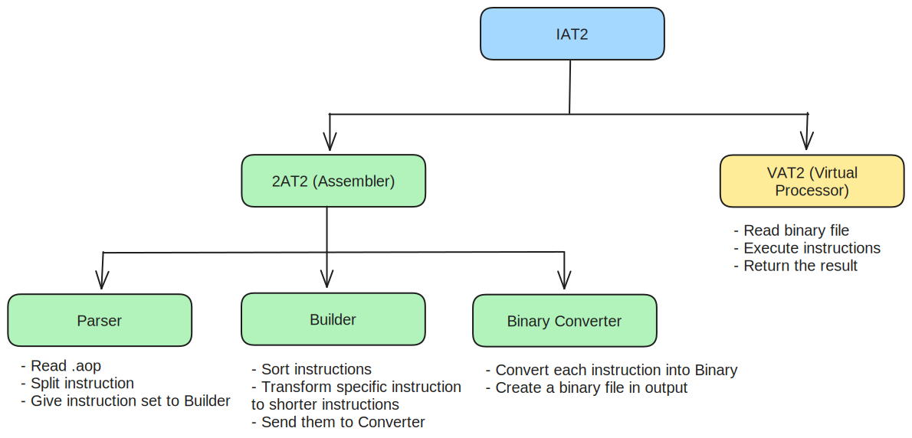

# Statement Of Work

Contents:

- [Statement Of Work](#statement-of-work)
  - [Introduction](#introduction)
  - [Statement of work](#statement-of-work-1)
    - [Project 3 Virtual Processor (IAT2)](#project-3-virtual-processor-iat2)
    - [Abstract](#abstract)
    - [Value](#value)
    - [Scope](#scope)
    - [Type](#type)
    - [Payment](#payment)
  - [Purpose](#purpose)
    - [Objectives](#objectives)
      - [OKRs](#okrs)
    - [Performance](#performance)
    - [Factors](#factors)
      - [CSF 1: Successful Parser Development](#csf-1-successful-parser-development)
      - [CSF 2: Robust Builder Module Implementation](#csf-2-robust-builder-module-implementation)
      - [CSF 3: Successful Converter Module Development](#csf-3-successful-converter-module-development)
      - [CSF 4: Alignment with Project Timeline and Quality Standards](#csf-4-alignment-with-project-timeline-and-quality-standards)
      - [CSF 5: Effective Knowledge Transfer and Documentation](#csf-5-effective-knowledge-transfer-and-documentation)
      - [CSF 6: Successful Initiation of Virtual Processor Development](#csf-6-successful-initiation-of-virtual-processor-development)
  - [Who does what](#who-does-what)
    - [People](#people)
    - [Roles](#roles)
    - [Responsibilities](#responsibilities)
      - [RACI Matrix](#raci-matrix)
  - [Context](#context)
    - [Present](#present)
    - [Future](#future)
  - [Planning](#planning)
    - [Requirements](#requirements)
    - [Specifications](#specifications)
    - [Work breakdown structure (WBS)](#work-breakdown-structure-wbs)
    - [Applicable standards](#applicable-standards)
    - [Method and source of acceptance](#method-and-source-of-acceptance)
    - [Project management control procedures](#project-management-control-procedures)
    - [Change management procedures](#change-management-procedures)
  - [Other terms and conditions](#other-terms-and-conditions)
    - [Authorities](#authorities)
    - [Client's obligations](#clients-obligations)
      - [Access and Support from Client](#access-and-support-from-client)
    - [Contractor's obligations and Responsibilities](#contractors-obligations-and-responsibilities)
    - [Location of work, work site, and delivery point](#location-of-work-work-site-and-delivery-point)
    - [Language of work](#language-of-work)
    - [Security requirements](#security-requirements)
  - [Schedule](#schedule)
    - [Expected start date and completion date](#expected-start-date-and-completion-date)
    - [Schedule](#schedule-1)
    - [Glossary](#glossary)

## Introduction

A statement of work (SOW) is a document which is the narrative description of a project's work requirement. It defines project-specific activities, deliverables and timelines for a vendor providing services to the client. Moreove, The SOW typically also includes detailed requirements and pricing, with standard regulatory and governance terms and conditions.

## Statement of work

### Project 3 Virtual Processor (IAT2)

### Abstract

The goal is to design our own assembly language and to create the related assembler and its virtual processor.
We started by thinking to an interpreter due to a misscomprehension of the call for tender we started to work in the wrong way until a discussion with the customer.

### Value

The project will cost around 600 hours of work but as an internal project it will not cost any manpower and material fees.

### Scope

For this project we chose to work the closer possible as a real processor with our team of 6 people, including only 2 developers in non full-time due to annexe courses, reducing the amount of project time, we have 600 hours of work to do in 540 hours of project, it will be short.

### Type

This is a school project made to learn and pratice C and train ourselves in difference team roles like in professional environment.

### Payment

As students who will work in internal of a school we will not get paid and the project doesn't require any material to buy, no payment has been planned for now.

## Purpose

### Objectives

#### OKRs

| O1 | Develop a Functional Parser for the Assembler |
| --- | --- |
| KR1 | Complete research on parsing techniques and tools. |
| KR2 | Implement a basic parser that successfully reads and interprets AT2 language syntax. |
| KR3 |  Conduct internal testing to ensure the parser meets accuracy and efficiency standards. |
| KR4 | Perform a code review to identify and address any potential issues or improvements in the parser. |
| KR5 | Collaborate with team members to gather feedback on the parser's usability and user-friendliness. |

| O2 | Build a Robust Builder Module for the Assembler |
|--|--|
| KR1 | Research best practices for assembler construction and design. |
| KR2 | Implement a builder module that translates parsed instructions into executable machine code through the converter. |
| KR3 | Conduct thorough testing to validate the accuracy and efficiency of the builder module. |

| O3 |  Create a Converter Module |
| --- | --- |
| KR1 | Investigate converter module requirements for the assembler. |
| KR2 | Develop a converter module that transforms AT2 code into machine code suitable for the target architecture. |
| KR3 | Verify the compatibility and effectiveness of the converter module through extensive testing. |

| O4 | Ensure Alignment with Project Timeline and Quality Standards |
|--|--|
| KR1 | Establish a timeline for the completion of assembler development with clear milestones. |
| KR2 | Regularly review progress against the established timeline and make adjustments as necessary. |
| KR3 | Ensure that the assembler meets quality standards and project requirements. |

| O5 | Facilitate Knowledge Transfer and Documentation |
|--|--|
| KR1 | Document the assembler's architecture, modules, and functionalities comprehensively |
| KR2 | Conduct knowledge-sharing sessions to transfer expertise to team. |
| KR3 |Obtain feedback on documentation to refine and improve the materials.|

| O6 | Initiate Development of the Virtual Processor |
| -- | --|
| KR1 | Define the key features and specifications for the virtual processor. |
| KR2 | Develop a prototype of the virtual processor with basic functionality. |
| KR3 |  Conduct internal testing on the prototype to identify and resolve any critical issues or bugs. |
| KR4 | Collaborate with team members to gather feedback on the virtual processor's initial performance and usability. |
| KR5 | Document the progress and challenges faced during the virtual processor development for future reference. |

### Performance

Our KPIs can be seen on our spreadsheet [HERE](https://docs.google.com/spreadsheets/d/13n8fdWMEYFlJKhJ_OWILYcpX_c6CvLBpt4ebboLiU18/edit#gid=0).

### Factors

For the success of this project according to deadlines, we will need a lot of personal commitment and we must ensure that project time is not compromised by classes, events, exams or just beeing deleted due to an unpredictable issue.

#### CSF 1: Successful Parser Development

**Objective:**  Develop a Functional Parser for the Assembler. 

| **Key Results** | **Candidate Critical Success Factors** |
| --- | --- |
| KR1 | Successful completion of research on parsing techniques and tools. |
| KR2 | Implementation of a basic parser interpreting AT2 language syntax. |
| KR3 | Internal testing ensuring the parser meets accuracy and efficiency standards. |
| KR4 | Code review identifying and addressing potential issues or improvements. |
| KR5 | Collaboration for feedback on parser's usability and user-friendliness. |

#### CSF 2: Robust Builder Module Implementation

**Objective:** Build a Robust Builder Module for the Assembler.

| **Key Results** | **Candidate Critical Success Factors** |
| --- | --- |
| KR1 | Research on best practices for assembler construction and design. |
| KR2 | Implementation of a builder module translating parsed instructions into executable machine code through the converter. |
| KR3 | Thorough testing to validate the accuracy and efficiency of the builder module. |

#### CSF 3: Successful Converter Module Development

**Objective:** Create a Converter Module.

| **Key Results** | **Candidate Critical Success Factors** |
| --- | --- |
| KR1 | Investigation of converter module requirements for the assembler. |
| KR2 | Development of a converter module transforming AT2 code into machine code for the target architecture. |
| KR3 | Verification of compatibility and effectiveness through extensive testing. |

#### CSF 4: Alignment with Project Timeline and Quality Standards

**Objective:** Ensure Alignment with Project Timeline and Quality Standards.

| **Key Results** | **Candidate Critical Success Factors** |
| --- | --- |
| KR1 | Establishment of a timeline for assembler development with clear milestones. |
| KR2 | Regular review of progress against the established timeline and necessary adjustments. |
| KR3 | Assurance that the assembler meets quality standards and project requirements. |

#### CSF 5: Effective Knowledge Transfer and Documentation

**Objective:** Facilitate Knowledge Transfer and Documentation.

| **Key Results** | **Candidate Critical Success Factors** |
| --- | --- |
| KR1 | Comprehensive documentation of the assembler's architecture, modules, and functionalities. |
| KR2 | Conducting knowledge-sharing sessions for effective expertise transfer to the team. |
| KR3 | Obtaining feedback on documentation to refine and improve materials. |

#### CSF 6: Successful Initiation of Virtual Processor Development

**Objective:** Initiate Development of the Virtual Processor.

| **Key Results** | **Candidate Critical Success Factors** |
| --- | --- |
| KR1 | Definition of key features and specifications for the virtual processor. |
| KR2 | Development of a prototype with basic functionality. |
| KR3 | Internal testing on the prototype to identify and resolve critical issues or bugs. |
| KR4 | Collaboration for feedback on the virtual processor's initial performance and usability. |
| KR5 | Documentation of progress and challenges during virtual processor development. |

## Who does what

### People

| **Picture**                                                                         | **Name**               | **Role**          | **Email** |
|------------------------------------------------------------------------------------------------ | ---------------------- | ----------------- | ---- |
|  | **Mathias GAGNEPAIN**  | Project Manager   | mathias.gagnepain@algosup.com |
|  | **Guillaume DESPAUX**  | Program Manager   |  guillaume.despaux@algosup.com |           
|  | **Guillaume DERAMCHI** | Technical Leader  | guillaume.deramchi@algosup.com|
|  | **Maxime CARON**       | Software Engineer | maxime.caron@algosup.com |
|  | **Paul NOWAK**         | Software Engineer | paul.nowak@algosup.com |
|  | **Enzo GUILLOUCHE**    | Quality Assurance | enzo.guillouche@algosup.com|
|  | **Franck JEANNIN** | Customer | franck.jeannin@algosup.com |

### Roles

| Type | Role | Description |
| --- | --- | --- |
| Employee | **Project Manager** | - Managing time by communicating with the team (through meetings, daily check-ins, emails or calls). They need to know the status of every step taken by the team, and to make sure that everyone stays on track.  - Anticipating potential roadblocks and issues, and proactively resolving them or escalating the issue to management.  - Budgeting and allocating resources. Depending on the team’s needs, they might be advocating for more or different resources.  - Keep the team motivated and happy, so they can be as productive as possible. They might plan team-building exercises or events. |
| Employee | **Program Manager** | - Writing the functional specifications according to the client’s needs and expectations, and possibly re-writing them as the product evolves and the client highlights new needs.  - Handling communication with the stakeholders/clients and the development team: they must create a glossary to make sure everyone each party understands the other and uses the correct terms.  - Leading focus groups where they collect users’ feedback and opinions, and analysing the users’ feedback to highlight their needs, as well as doing a competitor analysis.  - Sharing their findings with the development team so changes can be made; they are the main link between the prospective users (persona) and the team, and need to be able to explain the users’ point of view and needs to the developers. | 
| Employee | **Technical Leader** | - Interacting with the program manager to understand the functional specifications and translate them into technical specifications, deciding which tools will be the best fitted to develop the product.  - Performing code reviews on a regular basis, to ensure the quality of the product. They work on the prototype development, code and/or technological assessment.  - Writing the architecture diagram that will contain all the information necessary to the software’s creation, such as internal and external component and how said components interact and communicate with one another. |
| Employee | **Software Engineer** | - Writing the code and developing the product, including identifying and fixing any technical issue. They can and should use methods such a unit testing to make sure that the code works correctly.  - Participating in the technical design of the product and determining project requirements, which will then lead to suggesting the software architecture.  - Ensuring that the product’s quality matches the client’s expectations.  - Writing the code’s documentation, making sure it follows the convention. | 
| Employee | **Quality Assurance** | - Writing extensive test plans: what there is to check, and how it will be checked.  - Finding bugs and issues while the product is being developed, by running tests and checking the functionalities. They can and should create tools for automating the testing.  - Keeping track on each bug and issue encountered, and how it was fixed, by using a database of bugs.  - Checking that needed modifications are done according to the specifications, and that issues have been fixed properly. |
| Stakeholder | **Customer/Client** | - Clearly articulate the goals and objectives of the project.  - Detail the functional and technical requirements for the desired system or solution.  - Identify key stakeholders and define their roles in the project.  - Specify preferred communication channels and frequency for project updates.  - Review and approve the project plan, including timelines and milestones. | 

### Responsibilities

#### RACI Matrix

| Name                      | Project Manager | Program Manager | Technical Leader | Software Engineer | Quality Assurance | Client | Stakeholders |
| ------------------------- | --------------- | --------------- | ---------------- | ----------------- | ----------------- | ------ | ------------ |
| Project brief             | I               | I               | I                | I                 | I                 | R / A  | C            |
| Project charter           | R / A           | C / I           | C / I            | C / I             | C / I             | C      | C / I        |
| Schedule / Gantt chart    | R / A           | C / I           | C / I            | C / I             | C / I             | -      | I            |
| Functional specifications | C               | R / A           | C                | -                 | C / I             | C      | I            |
| Technical specifications  | C               | C               | R / A            | C                 | C / I             | C      | I            |
| Code                      | -               | -               | R                | R / A             | I                 | -      | -            |
| Code review               | I               | -               | R / A            | R                 | R                 | -      | -            |
| Code documentation        | -               | I               | C                | R / A             | C / I             | I      | -            |
| Usage instructions        | -               | I               | C                | R / A             | C / I             | I      | -            |
| Testing plan              | I               | C               | C                | C                 | R / A             | I      | -            |

Key:
| Letter | Name        | Description                                                                                                                                       |
| ------ | ----------- | ------------------------------------------------------------------------------------------------------------------------------------------------- |
| R      | Responsible | Work to complete the task.                                                                                                                        |
| A      | Accountable | must sign off (approve) work that responsible provides. The one to praised or blame.                                                              |
| C      | Consulted   | Those whose opinions are sought, typically subject-matter experts, and with whom there is two-way communication.                                  |
| I      | Informed    | Those who are kept up-to-date on progress, often only on completion of the task or deliverable, and with whom there is just one-way communication |
|        | -           | Not involved                                                                                                                                      |

A readable and colored RACI spreadsheet can be found [HERE](https://docs.google.com/spreadsheets/d/17-31PYeuYhOWX956qyZJER-_5GFUCzEy7xImLAHIEhA/edit?usp=sharing).

## Context

### Present

The actual work asked by [ALGOSUP](https://algosup.com) serves as C language practicing in company conditions to train their students as real professionals.

This project helped use to know how a computer works and lead us to a better knowledge of programming but also others roles related to the [IT](https://en.wikipedia.org/wiki/Information_technology) professional world.

### Future

In the future the project can be used by [ALGOSUP](https://algosup.com) to propose a new project to their students based on this project.

## Planning

### Requirements

**Project Tasks and Deliverables Overview:**

*Contractor Responsibilities:*

1. **Assemble Initial Project Plan:**
   - Develop a comprehensive project plan outlining tasks, milestones, and deliverables.
   - Specify methodology, including any iterative or Agile approaches if applicable.
   - Identify the language, format, and version control for the project plan.

2. **Requirements Gathering:**
   - Conduct in-depth requirements gathering sessions with stakeholders.
   - Clearly document system, functional, and technical requirements.
   - Define the language, format, and versioning for the requirements documentation.

3. **System Design:**
   - Generate a detailed system design based on gathered requirements.
   - Clearly articulate the language, format, and version of the design documentation.
   - Provide a methodology for client review and approval of the system design.

4. **Prototype Development:**
   - Develop a functional prototype based on the approved system design.
   - Specify the language, format, and version control for the prototype.
   - Establish a method for client testing and feedback on the prototype.

5. **Full System Development:**
   - Implement the full system based on the approved design and prototype.
   - Detail the development methodology, language, and version control.
   - Include a schedule indicating milestone completion and anticipated delivery dates.

6. **Testing and Quality Assurance:**
   - Conduct thorough testing, including unit, integration, and user acceptance testing.
   - Specify the language, format, and version control for testing documentation.
   - Define the criteria for acceptance and approval of the tested system.

7. **Documentation and Training:**
   - Create comprehensive documentation for system use and maintenance.
   - Establish language, format, and version requirements for all documentation.

8. **Deployment:**
   - Implement the system into the client's environment.
   - Provide language, format, and version control details for deployment documentation.
   - Define the acceptance criteria for the deployed system.

*Deliverables:*

1. **Project Plan:**
   - Detailed project plan with outlined tasks, milestones, and timelines.

2. **Requirements Documentation:**
   - Clearly documented system, functional, and technical requirements.

3. **System Design Document:**
   - Detailed system design document approved by the client.

4. **Functional Prototype:**
   - Functional prototype for client testing and feedback.

5. **Fully Developed System:**
   - Fully implemented system based on the approved design.

6. **Testing Documentation:**
   - Comprehensive testing documentation, including test cases and results.

7. **User Documentation:**
   - Thorough user documentation for system use and maintenance.

8. **Deployment Documentation:**
   - Documentation for the successful deployment of the system.

*Acceptance Criteria:*

- Possibility to execute our own assembly language through an interpreter or an assembler
- The language, format, and version control requirements will be outlined in each respective documentation and agreed upon during project initiation.

*Schedule and Estimated Level of Effort:*

- A detailed schedule with milestones and estimated effort will be provided in the project plan ([HERE](https://docs.google.com/spreadsheets/d/1nawLT6dMtwPcFpHMa4k32Nxjinokl4ZmX4GMZl1Fatc/edit#gid=0)).

### Specifications

- The project specifications will follow the [functional specifications](../functional/functional_specification_documentation.md).
- The Language will adhere to the [AT2 Documentation](../functional/at2_language_documentation.pdf)
- The project architecture will follow the [technical specifications](../technical/technical.md)
- The project test will adhere to the [test plan](../qa/test_plan.md) and [test cases](../qa/test_cases.md)

### Work breakdown structure (WBS)
 

### Applicable standards

**Adherence to Industry Standards and Guidelines:**

*Industry Standards:*

1. **ISO/IEC 12207:**
   - Adherence to the ISO/IEC 12207 standard for Software and Systems Engineering processes.

2. **IEEE 830-1998:**
   - Compliance with IEEE 830-1998 standard for Software Requirements Specifications.

3. **ISO/IEC 27001:**
   - Conformity to ISO/IEC 27001 for Information Security Management System.

*Regulatory Compliance:*

1. **GDPR (General Data Protection Regulation):**
   - Ensuring compliance with GDPR regulations for the protection of personal data.

*Guidelines and Templates:*

1. **Coding Standards:**
   - Following industry-recognized coding standards, such as those outlined by the relevant programming language community or the client.

2. **Testing Guidelines:**
   - Adherence to testing guidelines, including the use of standardized test cases and documentation.

### Method and source of acceptance

*Quality and Performance Criteria:*

1. **Adherence to Specifications:**
   - All deliverables must adhere to the specifications outlined in the project requirements and any accompanying documentation.

2. **Functional Testing:**
   - The contractor shall conduct rigorous functional testing to ensure that each deliverable performs as intended and meets the functional requirements.

3. **Compatibility Testing:**
   - Compatibility testing across different environments and platforms to ensure seamless operation.

4. **User Acceptance Testing (UAT):**
   - Inclusion of a UAT phase where end-users evaluate the product to ensure it aligns with their needs and expectations.

5. **Performance Metrics:**
   - Measurement against predefined performance metrics, such as response time, throughput, and system stability.

*Format and Documentation Requirements:*

1. **Documented Deliverables:**
   - Submission of comprehensive documentation for each deliverable, including but not limited to user manuals, technical specifications, and design documents.

2. **Version Control:**
   - Clear version control and documentation of changes made to deliverables over time.

3. **Coding Standards Compliance:**
   - Verification that coding standards are followed and well-documented.

*Testing and Validation Processes:*

1. **Automated Testing:**
   - Implementation and documentation of automated testing procedures.

2. **User Feedback Analysis:**
   - Analysis of user feedback to identify and address any usability issues.

3. **Bug Tracking and Resolution:**
   - Establishment of a bug tracking system and resolution process.

*Client Approval and Verification:*

1. **Client Review:**
   - Client review of deliverables against predefined acceptance criteria.

*Continuous Improvement Feedback:*

1. **Feedback Mechanism:**
   - Establishing a mechanism for continuous improvement based on feedback received during the project.

### Project management control procedures

The developement team will send regularly an email to the client to keep it inform of the project progression, gather is question or modification request and ask him our questions.

### Change management procedures

*Anticipation of Changes:*

1. **Anticipation Clause:**
   - While it is anticipated that the project scope outlined in this Statement of Work (SOW) will remain unchanged, the agreement acknowledges the potential for unforeseen circumstances or evolving project needs.

*Change Request Initiation:*

1. **Written Request Requirement:**
   - Any proposed changes to the project scope must be submitted in writing by the Work Authority. This written request shall detail the nature and rationale for the proposed changes.

2. **Justification for Changes:**
   - The Work Authority is required to provide a clear justification for the proposed changes, explaining the necessity and potential impact on the project.

*Evaluation and Approval Process:*

1. **Change Review Committee:**
   - A Change Review Committee will be established to evaluate proposed changes. The committee will include representatives from relevant stakeholders.

2. **Impact Assessment:**
   - The committee will conduct a comprehensive impact assessment to evaluate the implications of the proposed changes on project timelines, and resources.

3. **Risk Analysis:**
   - A risk analysis will be performed to identify any potential risks associated with implementing the proposed changes.

4. **Approval Authority:**
   - No changes to the project scope will be implemented without obtaining the explicit written approval of the Contractor.

*Communication and Documentation:*

1. **Stakeholder Notification:**
   - All relevant stakeholders will be notified of approved changes, and any necessary adjustments to project plans, schedules will be communicated.

2. **Version Control:**
   - Version control will be maintained for all project documentation to accurately reflect the approved changes.

## Other terms and conditions

### Authorities

| Authority | Team | Who ? |
| --- | --- | --- |
| Work Authority | Technical Team | - Technical Leader - Software Engineer - Quality Assurance |
| Contracting Authority | Management Team | - Project Manager - Program Manager - Technical Leader |

### Client's obligations

#### Access and Support from Client

The Client will provide the Contractor with the necessary access and support to facilitate the successful execution of the project. This includes, but is not limited to:

1. **Access to Policies and Documentation:**
   - The Client will grant access to relevant policies, procedures, publications, reports, studies, and other documentation essential for the project's execution.

2. **Availability of Staff:**
   - The Client will ensure the availability of staff members whom the Contractor may need to consult during different phases of the project.

3. **Guidelines, Standards, and Regulations:**
   - The Client will furnish the Contractor with access to appropriate guidelines, standards, and industry regulations pertinent to the project's requirements.

4. **Feedback on Draft Reports:**
   - The Client commits to providing comments on draft reports within five working days from the receipt of the report, facilitating a streamlined feedback process.

5. **Provision of Applicable Documentation:**
   - The Client will provide any additional documentation deemed necessary for the successful completion of the project.

This collaborative approach ensures that the Contractor has the necessary resources, information, and support from the Client to meet the project's objectives in a timely and efficient manner.

### Contractor's obligations and Responsibilities

As part of the contractual agreement, the Contractor is obligated to adhere to the following terms and responsibilities:

1. **Confidentiality:**
   - Maintain strict confidentiality regarding all documents and proprietary information shared by the Client during the contract period.

2. **Task, Deliverable, and Milestone Completion:**
   - Meet all assigned tasks, deliverables, and milestones within the agreed-upon timelines.

3. **Return of Client Materials:**
   - Return all materials, including documents and equipment, belonging to the Client upon the successful completion of the contract.

4. **Deletion of Electronic Correspondence:**
   - Delete all electronic forms of correspondence, such as emails, at the conclusion of the contract.

5. **Submission of Reports:**
   - Submit all written reports in PDF electronic file format, ensuring clarity and ease of access.

6. **Maintenance of Security Clearance:**
   - Maintain the required security clearance throughout the contract period, ensuring no conflicts that may compromise project integrity.

7.  **On-Site Meetings:**
    - Attend meetings at the Client's site if such attendance is deemed necessary for project collaboration and progress.

By fulfilling these obligations, the Contractor contributes to the smooth and successful execution of the project, aligning with the terms established in this contractual arrangement.

### Location of work, work site, and delivery point

In alignment with the contractual terms, the work is expected to be completed under the following conditions:

*Due to existing workload and deadlines, all personnel assigned to any Contract must be ready to work in close and frequent contact with the Client's personnel. The primary work location will be at the Contractor's facility.*

This arrangement ensures effective collaboration and communication between the Contractor's team and the Client's personnel, facilitating the successful execution of the project.

### Language of work

All our interaction with and client, stakeholders and among the team will be done in **English**.

### Security requirements

Non special security requirements.

## Schedule

### Expected start date and completion date

*The work is expected to be performed over a period of approximately 8 weeks, starting on 01/08/2024, and with anticipated completion around 02/23/2024. Further details regarding the specific schedule and allowable time for work will be outlined in the dedicated schedule section of the SOW.*

### Schedule

The schedule can be seen on the tasks detail [HERE](https://docs.google.com/spreadsheets/d/1nawLT6dMtwPcFpHMa4k32Nxjinokl4ZmX4GMZl1Fatc/edit#gid=0)

### Glossary

| Word | Definition |
|---| --- |
| SOW | Statement Of Work |
| SOO | Statement Of Objectives
| OKR | Objective and Key Result |
| WBS | Work Breakdown Structure |
| KPIs | Key Performance Indicators |
| PWS | Performance Work Statement |
| CDRL | Contract Data Requirements List |
