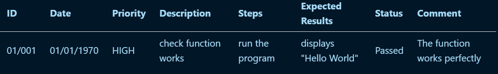
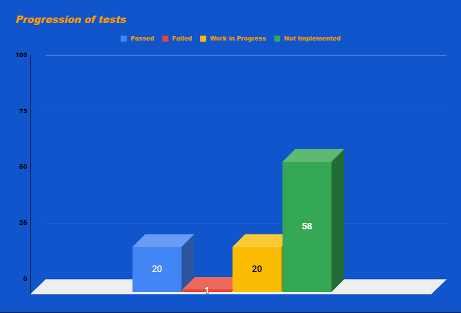

# Virtual Processor Project Test Plan

Table of Contents

- [Virtual Processor Project Test Plan](#virtual-processor-project-test-plan)
  - [1. Product Analysis](#1-product-analysis)
    - [1.2. Overview](#12-overview)
  - [2. Glossary](#2-glossary)
  - [3. Testing](#3-testing)
      - [3.0.1. In-scope for Testing](#301-in-scope-for-testing)
      - [3.0.2. Out-of-scope for Testing](#302-out-of-scope-for-testing)
    - [3.1 Strategy](#31-strategy)
    - [3.2. Unit Tests](#32-unit-tests)
    - [3.3. Testing sessions](#33-testing-sessions)
      - [3.3.1. Overview](#331-overview)
      - [3.3.2. Smoke Testing](#332-smoke-testing)
        - [3.3.2.1. Smoke Testing Scope](#3321-smoke-testing-scope)
        - [3.3.2.2. Sequence of Smoke Testing](#3322-sequence-of-smoke-testing)
      - [3.3.3. Collaborative Testing Sessions](#333-collaborative-testing-sessions)
        - [3.3.3.1. Session Scope](#3331-session-scope)
    - [3.4. External tools](#34-external-tools)
        - [3.4.1. GitHub Actions](#341-github-actions)
          - [3.4.1.1. GitHub Actions Scope](#3411-github-actions-scope)
          - [3.4.1.2. Workflow](#3412-workflow)
          - [3.4.1.3. Configuration](#3413-configuration)
        - [3.4.2. GitHub Issues](#342-github-issues)
        - [3.4.3. Tests and Meetings](#343-tests-and-meetings)
        - [3.4.4. Tests Convention](#344-tests-convention)
  - [4. Test Criteria](#4-test-criteria)
    - [4.1. Suspension Criteria](#41-suspension-criteria)
    - [4.2. Exit Criteria](#42-exit-criteria)
  - [5. Allocated Resources](#5-allocated-resources)
    - [5.1. Time](#51-time)
    - [5.2. Collaborators](#52-collaborators)

---

## 1. Product Analysis

### 1.2. Overview

The project aims to create a virtual processor and an interpreter for running assembly code on that processor. The project would be developed in plain, portable, C language without the use of any external library beside C standard libraries. 

The assembly code will be created from scratch by us, it will be named AT2. It will deal with new names for several instructions and statements; while making sure that the purpose of an assembly language, which is to be more efficient and closer to the machine, is respected.

For further details, refer to the [functional specifications](../functional/functional_specification_documentation.md) document.

## 2. Glossary

| Term | Definition | Source |
| ---- | ---------- | ------ |
| **Assembly language** | A low-level programming language for a computer, or other programmable device, in which there is a very strong (generally one-to-one) correspondence between the language and the architecture's machine code instructions. | [Wikipedia](https://en.wikipedia.org/wiki/Assembly_language) |
| **Interpreter** | In this case, an interpreter is a computer program that directly executes instructions written in a programming or scripting language, without requiring them previously to have been compiled into a machine language program. | [Wikipedia](https://en.wikipedia.org/wiki/Interpreter_(computing)) |
| **Virtual Processor** | A processor (or processing unit) is an electrical component that performs operations on an external data source, usually memory or some other data stream. A virtual processor is basically a virtual machine that simulates the behavior of a processor. | [Wikipedia](https://en.wikipedia.org/wiki/Processor_(computing)) |
| **AT2 language** | The revisited Assembly language used in this project. AT2 stands for **A**ssembly **T**eam **2**. | [Documentation](https://github.com/algosup/2023-2024-project-3-virtual-processor-team-2/blob/main/documents/functional/at2_language_documentation.pdf) |
| **Smoke Testing** | A testing method that is used to determine if a new software build is ready for the next testing phase. | [Wikipedia](https://en.wikipedia.org/wiki/Smoke_testing_(software)) |
| **GitHub Actions** | A CI/CD tool that allows us to run tests automatically after various actions on the repository and avoid errors on the dev or main branch. | [GitHub](https://docs.github.com/en/actions) |
| **GitHub Issues** | A tool that allows us to create, manage, and assign issues to team members. | [GitHub](https://docs.github.com/en/issues) |
| **GitHub Wiki** | Every GitHub repository can be equipped with a wiki, to share long-form content about your project, such as how to use it, how you designed it, or its core principles. | [GitHub](https://docs.github.com/en/communities/documenting-your-project-with-wikis/about-wikis) |

---

## 3. Testing

Tests serve as a tool for improving the quality of the product. 
Functional testing will mainly contain basic instructions in AT2 code to ensure that the quality of the required product is perfect.  The quality of all the product's features is mainly endorsed by Software Engineers and Quality assurances.

#### 3.0.1. In-scope for Testing

- Test if users can be able to enter, modify, and delete text within the text file using keyboard input or other input methods.
- Test if the interpreter can be capable of executing the parsed code instructions according to the semantics and rules defined by the programming language.
- Test if the interface can display text output from the system and accept text input from the user.   
For further details, refer to the [functional specifications](../functional/functional_specification_documentation.md) document.

#### 3.0.2. Out-of-scope for Testing

- Test the implementation of a debugger.
- Test an assembler system.   
For further details, refer to the [functional specifications](../functional/functional_specification_documentation.md) document.

### 3.1 Strategy

Here's the purpose of our testing strategy:   - We will implement **[Unit Tests](#32-unit-tests)** to ensure the quality of the code.   - We will perform **[Testing sessions](#33-testing-sessions)** to ensure that the documented quality of the project is up-to-date.   - We will use **[External tools](#34-external-tools)** to help us testing the product.

---

### 3.2. Unit Tests

Unit testing is an important part of the process. These tests will be written by the Software Engineers throughout the project, in parallel with project development. Then, the Quality Assurance will run these tests during tests cases.  Regarding this project, most of the tests would be unit tests.

#### These unit tests serve three crucial objectives:

1. **Code Functionality:** Verify that each function performs as expected under various scenarios. 

2. **Code Quality:** Assess the clarity and quality of the code to promote maintainability and ease of collaboration among developers. 

3. **Code Coverage:** Guarantee comprehensive testing to prevent future changes from unintentionally altering the original behavior of the code.

---

### 3.3. Testing sessions

#### 3.3.1. Overview

Once the project will reach a certain term of development, we will perform functional testing, using a combination of **[Smoke Testing](#332-smoke-testing)** and **[Collaborative Testing Sessions](#333-collaborative-testing-sessions)**. It will ensure the quality of the product. 

#### 3.3.2. Smoke Testing

Testing sessions will take place during and after days dedicated to the project, they will serve as smoke tests. The primary goal of smoke testing is to quickly assess whether the essential functionalities of the project are working as expected after each build. This testing phase is designed to identify critical issues early in the development process, allowing for rapid feedback and swift resolution of potential show-stopping problems.

#### 3.3.2.1. Smoke Testing Scope

The smoke testing scope will focus on the fundamental aspects of the product, including:

1. **Process Launch:** Confirm that the product launches successfully without any critical errors or crashes.
2. **Instructions functionality:** Check that basic instructions work as expected.

#### 3.3.2.2. Sequence of Smoke Testing

During each smoke testing session, the following steps will be executed:

1. **Product Deployment:** Deploy the latest product in the testing environment.
2. **Test Execution:** Execute a set of predefined [test cases](./test_cases.md) covering the functionalities.
3. **Archiving results:** Archive the [test results](./test_reports.md) for future reference.
4. **Issue Reporting:** If critical issues are identified, we need to report them to the development team.

---

#### 3.3.3. Collaborative Testing Sessions
To obtain a better overview of the project, a collaboration with other teams' Quality Assurance was set up. This collaboration enables the teams to have an external view of their product and simply identify errors and bugs. The main advantage of this collaboration is to have several points of view on the same situation and to see or share new working methods. All the meetings' content will be written back in the [meetings reports](./meetings_reports.md) file. 
A meeting with the Software Engineers of the team 2 will be planned the day after each collaborative testing session.

#### 3.3.3.1. Session Scope

Sessions are designed primarily to:

1. **Verify that the product is working as expected:** Check that all the product's basic instructions and additional statements are working properly.
2. **Sharing tests:** Share tests cases and reports between the teams to have a better overview of their product and to find easier bugs and errors.
3. **Identify bugs and errors:** Find bugs and errors in the product to improve it.
4. **Identify improvements and missing features:** Find improvements and missing features in the product to bring it as far as possible.

---

### 3.4. External tools

#### 3.4.1. GitHub Actions

GitHub Actions are utilized for continuous integration and deployment. The workflow is triggered on each push to the main branch, ensuring the automatic execution of tests. (During the development phase, the workflow will also be triggered on each push to the dev branch.)

It will allow us to know if the code is unfunctional at some points, when it appeared and which changes caused it.

#### 3.4.1.1. GitHub Actions Scope

The GitHub Actions will be activated on pull requests on the dev and main branch and their scope is to:

1. **Launch and Interpret:** Launch the process and ensure there is no interpreting error.
2. **Run unit tests:** Run unit tests to ensure that the main functions of the product are working properly.
3. **Ensure that the code on the referenced branches is working:** Ensure that the code on the main and dev branches is working properly. Avoid creating new branches for programs that don't work.

#### 3.4.1.2. Workflow

The workflow consists of the following steps:

1. **Checkout:** Retrieves the repository.
2. **Build:** Builds the project.
3. **Test:** Executes unit tests and testing scripts.
4. **Publish Test Results:** Publish the test results as artifacts.

If any of the steps fail, the workflow will be marked as failed and the development team will be notified at which step the error occurred.

#### 3.4.1.3. Configuration

Actions will be performed mainly on a dedicated computer, which hosts the runner and serves as a server. These actions are enabled and synchronized with GitHub. Once the runner has been activated on the computer, it can be selected to execute the various workflow actions.

This allows us to have a runner available all time and to have a better overview of the errors that may occur.

---

#### 3.4.2. GitHub Issues

GitHub Issues is a built-in issue-tracking tool that allows us to create and manage issues and assign them to team members. This is mainly the role of the Quality Assurance to create as many GitHub Issues as there are problems regarding the product.

We define:

- **Bugs:** Unexpected problems or code errors.
- **Documentation:** Request for documentation on a specific function or group of functions in the code.
- **Task allocation:** Assignment and tracking of specific responsibilities.

**GitHub Issues Strategy:**

We are implementing a strategy for managing GitHub Issues. Here are the key components of our strategy:

1. **Detailed Issue Descriptions:**
   - Issues should have clear and detailed descriptions to provide context and understanding.
   - Include steps to reproduce bugs or details about the feature request.
   - Specify the expected and actual behavior. 
   -> linked with test reports

2. **Labeling System:**
   - Utilize labels to categorize issues, such as "bug," or "enhancement".
   - Labels help identifying the nature of the issue and prioritizing tasks quickly.

3. **Assignees and Responsibility:**
   - Assign issues to the appropriate team member or individuals responsible for addressing the problem.
   - Assignees take ownership of the task, improving accountability.

4. **Regular Issue Triage:**
    - Regularly review and triage open issues.
    - Prioritize tasks based on their urgency (Critical, High, Medium, Low).

By implementing these strategies, we aim to foster a more organized and efficient issue-tracking process on GitHub.

---

#### 3.4.3. Tests and Meetings

**Test Reports:**

The [test case spreadsheet](https://docs.google.com/spreadsheets/d/1_UT7jAKQBPeN4hyx2i_c3qdPqmBhTuxuURp5x7rv-hU/edit?hl=fr#gid=0) will contain all the test cases of the project. Each test case will be listed and named with the ID of the test and the date of the test session. 
The [test report spreadsheet](https://docs.google.com/spreadsheets/d/1_UT7jAKQBPeN4hyx2i_c3qdPqmBhTuxuURp5x7rv-hU/edit?hl=fr#gid=2036605100) will contain all the test reports of the project. Each test report will be listed and named with the ID of the test and the date of the test session.

**QA Meetings:**

The QA team could also have several meetings with the SE team, to talk about specific topics regarding the development. 

---

#### 3.4.4. Tests Convention

To document and track easily test cases, their results, and overall testing progress, the tests would be divided into these three sections:

1. **Test Case Pattern:** 

We have to make a certain pattern for test cases to ensure the readability and consistency of the work:

For further details, refer to the [test case](./test_cases.md) document.

2. **Test reports Pattern:**

We also have to make a certain pattern for test reports to ensure the readability and consistency of the work:

For further details, refer to the [test report](./test_reports.md) document.

3. **Progression:**
  - **Test Amount Representation:**
     - A visual schema representing the test reports based on the amount of their status (Passed, Failed, In Progress, Not Implemented).
     - Provides a visual snapshot of the overall testing status.   
     

You can see all tests on the [test spreadsheet](https://docs.google.com/spreadsheets/d/1_UT7jAKQBPeN4hyx2i_c3qdPqmBhTuxuURp5x7rv-hU/edit?hl=fr#gid=1784501131).
---

## 4. Test Criteria

Setting up strict test criteria is crucial to guarantee the product's quality before its release. These criteria act as standards that need to be met before the product is distributed. By following clear rules for suspension and exit, the testing process aims to find and fix issues early on.

### 4.1. Suspension Criteria

Suspension criteria are established to define conditions under which testing activities may be temporarily halted. The following suspension criteria are identified:

1. **Critical Bug Threshold:**
   - If a predetermined threshold of critical bugs is reached during testing (10% of total test cases), testing will be suspended.
   - Critical bugs are those with a "High" impact on the core functionality of the software.

2. **Resource Unavailability:**
   - If essential testing resources, such as testing environments, tools, or staff, become unavailable for an extended period, testing may be suspended.
   - This criteria ensures that testing can resume only when necessary resources are accessible.

### 4.2. Exit Criteria

Before the product can be considered ready for distribution, certain benchmarks must be met. For instance, at least 80% of all test cases should pass successfully. This criteria ensures that the product meets the required quality standards before reaching the distribution phase.

1. **Test Case Coverage:**
   - A minimum test case coverage of 80% for all identified features and functionalities must be achieved before considering the test phase complete.
   - This ensures that almost all aspects of the software have been tested.

2. **Bug Resolution Rate:**
   - At least 100% of 'High' and 'Medium' reported bugs must be addressed and resolved before exiting the testing phase.
   - At least 80% of 'Low' reported bugs must be addressed and resolved before exiting the testing phase.
   - This criteria emphasizes the importance of resolving identified issues to enhance the software's reliability
  
3. **Documentation Completeness:**
   - Comprehensive documentation, including test plans, test cases, test results, functional specifications, and technical specifications, must be finalized and reviewed for completeness.
   - Documentation should be easily understandable and accessible to all team members, ensuring a clear understanding of the testing processes and results.

## 5. Allocated Resources

### 5.1. Time

| Task | Start Date | End Date |
| ---- | ---------- | -------- |
| Review the documentation | January 15, 2024 | March 1, 2024 |
| First meeting with Dev team | January 23, 2024 | January 23, 2024 |
| Create and give templates | January 29, 2024 | January 29, 2024 |
| First meeting with other teams' QA | January 29, 2024 | January 29, 2024 |
| Second meeting with Dev team | January 30, 2024 | January 30, 2024 |
| GitHub Actions | February 02, 2024 | February 23, 2024 |
| Unit tests | February 05, 2023 | February 23, 2024 |
| Functional tests | February 19, 2024 | February 23, 2024 |

### 5.2. Collaborators

For this project, the people involved to perform tests are Quality Assurances of several teams during the team test sessions:
- Enzo GUILLOUCHE - Team 2
- Séréna BAVAROIS - Team 1
- Maxime THIZEAU - Team 4
- Arthur LEMOINE - Team 3

Thank you for sharing your time, to improve the quality of our work and our skills.