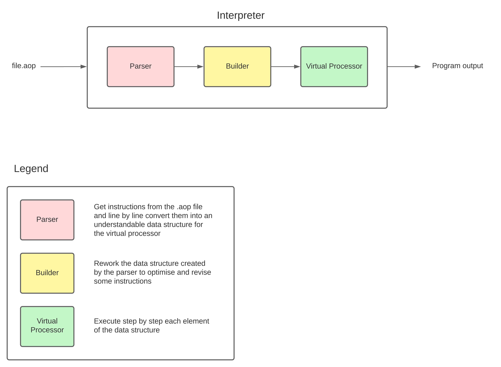
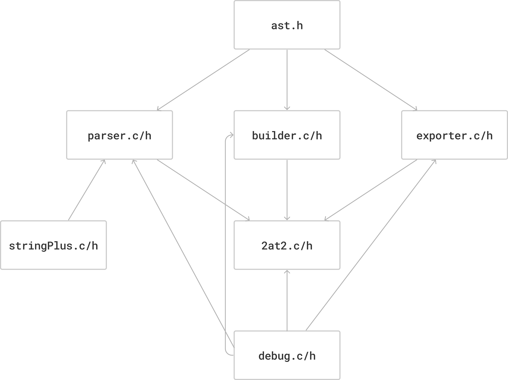
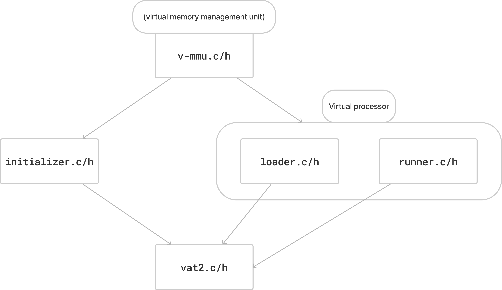

# Front matter

| | |
| ----- | ----- |
| Title | Virtual processor for customized assembly language |
| Author | Guillaume Deramchi |
| Team | 2 |
| Reviewer | Enzo Guillouche |
| Created on | 01/22/2024 |
| Last updated | 02/12/2024 |
| Task tracker | [Tasks & Schedule](https://docs.google.com/spreadsheets/d/1nawLT6dMtwPcFpHMa4k32Nxjinokl4ZmX4GMZl1Fatc/edit?usp=sharing) |

---


<details>
<summary>Table of contents</summary>

- [Front matter](#front-matter)
- [Before reading](#before-reading)
- [Introduction](#introduction)
  - [Overview](#overview)
  - [Glossary](#glossary)
  - [Context](#context)
- [Goals](#goals)
  - [Non-goals](#non-goals)
  - [Future goals](#future-goals)
  - [Assumptions](#assumptions)
- [Project folder structure](#project-folder-structure)
- [Conventions](#conventions)
  - [Naming conventions](#naming-conventions)
    - [Folders & files](#folders--files)
    - [Variables](#variables)
    - [Constants](#constants)
  - [Formatting conventions](#formatting-conventions)
    - [Indentation](#indentation)
    - [Line length](#line-length)
    - [Line breaks](#line-breaks)
    - [Comments](#comments)
    - [Whitespace](#whitespace)
- [About AT2](#about-at2)
- [Solution](#solution)
  - [Current solution](#current-solution)
  - [Proposed solution](#proposed-solution)
  - [Pros & cons of the solution](#pros--cons-of-the-solution)
- [Data model](#data-model)
  - [Parser](#parser)
  - [Builder](#builder)
  - [Converter](#converter)
  - [2at2.h](#2at2h)
  - [ast.h](#asth)
  - [builder.c](#builderc)
  - [builder.h](#builderh)
  - [debug.c](#debugc)
  - [debug.h](#debugh)
  - [parser.c](#parserc)
  - [parser.h](#parserh)
  - [stringPlus.c](#stringplusc)
  - [stringPlus.h](#stringplush)
  - [binExporter.c](#binexporterc)
  - [binExporter.h](#binexporterh)
- [Code organization](#code-organization)
- [Error system](#error-system)
- [Risks](#risks)
- [Business Logic](#business-logic)
  - [API Changes](#api-changes)
  - [Pseudocode](#pseudocode)
  - [Error States](#error-states)
  - [Failure Scenarios](#failure-scenarios)
  - [Conditions that Lead to Errors and Failures](#conditions-that-lead-to-errors-and-failures)
  - [Limitations](#limitations)
  - [Other Questions to Answer](#other-questions-to-answer)
- [Appendices](#appendices)
  - [Contributors](#contributors)
  - [Acknowledgments](#acknowledgments)
  - [Related documents](#related-documents)
  - [License](#license)
  - [References](#references)

</details>


---

# Before reading

Make sure to read the [functional specifications](/documents/functional/functional_specification_documentation.md) before reading this document, it will provide you useful information about what we aim to do for this project, as the functional is more focused on the "What" and the technical is more focused on the "How".

---

# Introduction

## Overview

The objective of this project is to create a virtual processor that runs customized assembly language. By using C standard libraries, the main aim is to develop a concise assembly language and construct a C program interpreter that can execute and validate assembly code. This solution is specifically designed for educational purposes and software developers who are keen on delving into low-level programming and processor emulation. The stakeholders of this project are on one side ALGOSUP, an international software development school, which gave us this project as well as 8 weeks to bring it to fruition, and on the other side, the Team 2 of ALGOSUP.

## Glossary

| Term | Definition |
| ---- | ---------- |
| Assembly Language | A low-level programming language used to communicate with a computer's hardware, using symbolic code rather than binary. |
| Interpreter | A program that directly executes instructions written in a programming or scripting language, without requiring them to be compiled into a machine language program. |
| Parser | A component that interprets text data to convert it into a format understandable by the computer. |
| Builder | In the context of programming, a builder constructs a final product or executable from source code. |
| Virtual Processor | A simulated version of a computer processor, used to emulate the functionality of a physical processor. |
| LIFO (Last-In-First-Out) | A method of processing data where the most recently added item is the first to be removed. |
| GitHub Desktop | A graphical user interface for managing GitHub repositories on a personal computer. |
| Bash | A Unix shell and command language, often used for scripting in various operating systems. |
| `.aop` Extension | A custom file extension, used for files containing AT2 code. |
| Debugging | The process of identifying and resolving bugs or errors in computer software. |
| IDE (Integrated Development Environment) | A software tool that combines code editing, debugging, and project management features to streamline software development |

## Context

As it's written above, the context of this project is an educational purpose. After asking for the reason why we are doing this project, the stakeholder answered that it was for educational purpose only. So there is no money involved, there is no real company goal as it's just for us to gain experience by working on it, as well as there is no real problem to solve here, apart of knowing how do create a virtual processor and an interpreter from scratch. Nevertheless, our solution will fit into the overall product roadmap as well as the technical strategy, and as it will be on a public GitHub repository, there may be chances of people using it for real problem solving. But we will dive into that later.

# Goals

- As a user, the virtual processor I'm coding on should be able to effectively execute the code I run and with no bugs.
- As a user, I'd like to work on a virtual processor that can run and debug my code.
- As a user, I'd like to code on a user-friendly and easily accessible virtual processor, with complete documentation.
- As a user, I'd like to have a access to enough instructions in order to optimize my code.
- As a user, I'd like to be able to change devices and still being able to code on a different.

## Non-goals

1. A very complete assembly language, with a very large set of instructions
2. A graphical user interface.
4. Compatibility with specific hardware configurations.
5. Compatibility with other programming languages.
6. Real-time performance analysis.
7. An advanced memory management.

## Future goals

- Integration with more advanced debugging tools.
- Support for additional, more complex assembly instructions.
- Expansion to real hardware implementation.

## Assumptions

- Availability of standard development tools like GCC, CMake, and Visual Studio Code.
- Access to modern computing hardware for development and testing.
- Basic user knowledge in assembly language and processor operations.

## Project folder structure

The folder structure for the project will be as follows:

```folder
├── 2023-2024-project-3-virtual-processor-team-2
|   ├── .github/workflows
|   |   ├── actions_dev.yml
|   ├── documents
|   |   ├── communications
|   |   |   ├── minutes_of_meeting_01_16_2024.pdf
|   |   ├── functional
|   |   |   ├── at2_assembly_language_documentation.md
|   |   |   ├── functional_specification_document_template.md
|   |   ├── images
|   |   |   ├── AOP
|   |   |   |   ├── ico
|   |   |   |   |   ├── aop_logo_256px.ico
|   |   |   |   ├── png
|   |   |   |   |   ├── aop_logo_256px.png
|   |   |   ├── AT2
|   |   |   |   ├── ico
|   |   |   |   |   ├── AT2_logo_256px.ico
|   |   |   |   ├── png
|   |   |   |   |   ├── AT2_logo_256px.png
|   |   |   ├── IAT2
|   |   |   |   ├── ico
|   |   |   |   |   ├── iat2_logo_256px.ico
|   |   |   |   ├── png
|   |   |   |   |   ├── iat2_logo_256px.png
|   |   |   ├── functional_images
|   |   |   |   ├── interpreter_mockup.png
|   |   |   |   ├── virtual_terminal.png
|   |   |   ├── management
|   |   |   |   ├── algosup_light_blue.svg
|   |   |   |   ├── algosup_orange.svg
|   |   |   |   ├── github_dark_logo.png
|   |   |   |   ├── github_light_logo.png
|   |   |   |   ├── linkedin_logo.png
|   |   |   ├── qa_images
|   |   |   |   ├── progression_graph.png
|   |   |   |   ├── test_case_pattern.png
|   |   |   |   ├── test_report_pattern.png
|   |   |   ├── technical_images
|   |   |   |   ├── Diagramming 101 (Community) (Copy) (2).png
|   |   |   |   ├── State-Diagram-parserC.jpg
|   |   |   |   ├── assembler.png
|   |   |   |   ├── data_model.png
|   |   |   |   ├── data_structure_diagram.jpg
|   |   |   |   ├── v-mmu.png
|   |   ├── management
|   |   |   ├── weekly_reports
|   |   |   |   ├── cumulative.md
|   |   |   |   ├── week_1.md
|   |   |   |   ├── week_2.md
|   |   |   |   ├── week_3.md
|   |   |   |   ├── week_4.md
|   |   |   |   ├── week_5.md
|   |   |   |   ├── week_6.md
|   |   |   |   ├── week_7.md
|   |   |   |   ├── week_8.md
|   |   |   ├── management_artifact.md
|   |   ├── qa
|   |   |   ├── code_documentation_template.md
|   |   |   ├── meetings_reports.md
|   |   |   ├── test_cases.md
|   |   |   ├── test_plan.md
|   |   |   ├── test_reports.md
|   |   ├── technical
|   |   |   ├── roadmap.md
|   |   |   ├── technical.md
|   ├── src
|   |   ├── 2at2.c
|   |   ├── 2at2.h
|   |   ├── ast.c
|   |   ├── ast.h
|   |   ├── binExporter.c
|   |   ├── binExporter.h
|   |   ├── builder.c
|   |   ├── builder.h
|   |   ├── debug.c
|   |   ├── debug.h
|   |   ├── error.c
|   |   ├── error.h
|   |   ├── parser.c
|   |   ├── parser.h
|   |   ├── stringPlus.c
|   |   ├── stringPlus.h
|   |   ├── vProc.c
|   |   ├── vProc.h
|   |   ├── vTerminal.c
|   |   ├── vTerminal.h
|   |   ├── vat2.c
|   ├── test
|   |   ├── aop
|   |   |   ├── add.aop
|   |   |   ├── addSymbol.aop
|   |   |   ├── and.aop
|   |   |   ├── andSymbol.aop
|   |   |   ├── comment.aop
|   |   |   ├── div.aop
|   |   |   ├── divSymbol.aop
|   |   |   ├── draw.aop
|   |   |   ├── leftShift.aop
|   |   |   ├── mod.aop
|   |   |   ├── modSymbol.aop
|   |   |   ├── mov.aop
|   |   |   ├── mul.aop
|   |   |   ├── mulSymbol.aop
|   |   |   ├── or.aop
|   |   |   ├── orSymbol.aop
|   |   |   ├── rightShift.aop
|   |   |   ├── sub.aop
|   |   |   ├── subSymbol.aop
|   |   |   ├── test.aop
|   |   |   ├── variable.aop
|   |   |   ├── xor.aop
|   |   |   ├── xorSymbol.aop
|   |   ├── test.cc
|   ├── .gitignore
|   ├── CMakeLists.txt
|   ├── CODE_OF_CONDUCT.md
|   ├── CONTRIBUTING.md
|   ├── LICENSE
|   ├── README.md
```

## Conventions

### Naming conventions

It is crucial to adhere to naming conventions in order to maintain a well-organized directory structure. Our project will adopt the subsequent naming conventions.

#### Folders & files

All the folders and files will be written in `snake_case`. 
Apart the following files that will be written in `UPPER_SNAKE_CASE`:
- `CODE_OF_CONDUCT.md`
- `CONTRIBUTING.md`
- `LICENSE`
- `README.md`
- `SECURITY.md`
And the `.gitignore` will be written this way.

#### Variables

Variable and functions names will be written in `camelCase`.

#### Constants

- Constant names will be written in `UPPER_SNAKE_CASE`.
- All `#define` statements will be written at the same place.

#### Error system

**The error system will work as follows:**

```
Error Type: [Kind of Error]
Details: [Provides detailed information about the error, varying the level of detail as needed]  
Line Number: [Line number where the error occurred]  
File Name: [Name of the file in which the error occurred]
```

For instance, in a realistic situation it would look like that:

```
Error Type: [Syntax Error]  
Details: [Missing semicolon at the end of the instruction. Ensure that each instruction is properly terminated.]  
Line Number: [23]  
File Name: [main.aop]  
```

### Formatting conventions

Formatting conventions are important to keep a clear, concise and readable code. Our project will adhere to the subsequent formatting conventions.

#### Indentation

Indentation will be done with 1 tab.

#### Line length 

Lines will be limited to 64 characters, whether it's a line of code or a comment.

#### Line breaks

- Break the line:
  - Two spaces before a function call or declaration.
  - One space between each variable declaration.
- Do not break the line:
  - Between a function name and its parameters.
  - In an `if` or a `switch` statement.
  - In a `for` or a `while` loop.

#### Comments

Comments will be written in English, on the line above the code they refer to and in `Sentence case`.

#### Whitespace

Whitespace is used to separate the elements of an instruction but is otherwise not significant.
## About AT2

We decided to rename our custom assembly language to "AT2" (Assembly Team 2). Its extension will be `.aop` (Assembly Operation Processor).  

For the complete reference manual, which includes the entire set of instructions with concrete examples, please refer to the **[AT2 language documentation](../functional/at2_language_documentation.pdf)**.

**Please make sure to read and understand it completely before going further in this document**.

## Solution

### Current solution

There's no current solution as this project is for an educational purpose, so we don't take over from another team.

### Proposed solution

Our suggested solution will be available on our GitHub repository. The solution will use Cmake to automate the software compilation process across different platforms and environments, C standard libraries for basic operations, gcc and g++ to compile the code into executable, and VSC will be our IDE.

### Dependecies 


The following table outlines the key dependencies of our solution:

| Component      | Dependency                       | Purpose                                           |
|----------------|----------------------------------|---------------------------------------------------|
| Parser         | C Standard Libraries             | To parse `.aop` files and generate instruction lists |
| Builder        | C Standard Libraries, Parser     | To construct executable programs from instruction lists |
| Converter      | C Standard Libraries, Builder    | To convert structured programs into binary format |
| Virtual Processor | C Standard Libraries, Converter | To execute binary files in a simulated processor environment |
| Debugging Tools | C Standard Libraries            | For error detection and resolution in development |
| CMake          | -                                | To automate the software compilation process across platforms |
| GCC            | CMake, C Standard Libraries     | To compile code into executable format |
| G++            | CMake, C Standard Libraries     | To compile C++ code, if used |
| Visual Studio Code | -                            | As an Integrated Development Environment (IDE) for coding and version control |
| GitHub Desktop | -                                | For managing GitHub repositories and version control |


### Pros & cons of the solution

**Pros**:

- Educational value: it's a good learning opportunity in low-level programming and processor emulation.
- Customization: the ability to tailor an assembly language to specific needs offers a focused approach to learning and software development.

- Portability and accessibility: using C standard libraries enhances the interpreter's compatibility with various operating systems, making it more accessible.

**Cons**:

- Complexity and time consumption: the design and implementation of a virtual processor and custom assembly language can be complex and require time and effort.
- Limited practical scope: a custom assembly language may not encompass all features of real-world processors, potentially limiting its practical application.

- Maintenance and documentation: ongoing maintenance and the need for thorough documentation can be challenging and resource-intensive.

## Data model

](../images/technical_images/data_model.png)

**Diagram explanation**:

- In a first time, the `.aop` file content will be read by the parser, then it will convert the lines into an algorithmic structure, as well as arranging the data for subsequent processing.
- Then the builder will process parsed instruction nodes, constructing a structured executable program suitable for assembling.
- After that, the structure will be executed by the assembler that will convert it in a binary file.

- Finally, the binary file will be ran by the virtual processor, on virtual memory.

### Parser


**Diagram explanation**:

- File reading: The parser begins by opening and reading the `.aop` file. It reads the file line by line, ensuring it only processes valid and readable content.
- Syntax checking: As it reads each line, the parser performs a syntax check. This step involves verifying that each line adheres to the expected format of the assembly language, including correct instruction syntax and operand usage.
- Tokenization: Each line is then tokenized. This process involves breaking down the line into individual components, such as operation codes (opcodes), registers, and values. Tokenization is essential for understanding the structure and meaning of each instruction.
- Instruction identification: The parser identifies the type of instruction on each line – whether it's an operation, a directive, a label declaration, or something else. This step is crucial for understanding how each line contributes to the overall program.
- Argument parsing: For lines with instructions, the parser extracts and parses the arguments or operands. This could include identifying register names, constants, or memory addresses, depending on the instruction.
- Semantic analysis: Beyond just understanding the syntax, the parser also performs a basic level of semantic analysis. This step checks the correctness of the instructions in the broader context of the program. For example, it ensures that labels are defined before they are used.
- Error handling: If the parser encounters any syntax or semantic errors, it generates appropriate error messages. These errors must be resolved before the code can proceed to the building phase.
- Building an intermediate representation: Once a line is successfully parsed, the parser constructs an intermediate representation of the instruction. This form is more suitable for the next stages of the interpreter, namely the builder and converter.
- Storing instructions: The parsed instructions, now in an intermediate form, are stored in a data structure for further processing by the builder.

- End of file: When the end of the file is reached, the parser concludes its operation, having converted the entire `.aop` file into a structured and interpretable format.

### Builder

 (Copy) (2).png)](<../images/technical_images/Diagramming 101 (Community) (Copy) (2).png>)

- Translating Parsed Instructions: After the parser reads and structures the assembly code into a series of instruction nodes (instNode_t), the builder takes these nodes and interprets them to prepare for execution. This involves translating assembly language constructs into a format that the virtual processor can understand and execute.

- Managing Control Flow: The builder handles control flow constructs like if/else statements and loops. It uses a Last-In-First-Out (LIFO) structure (lifoCmpNode_t) to manage nested if/else statements, ensuring that each block of code is executed in the correct order and context.
- Handling Labels and Variables: The builder processes labels and variable declarations within the assembly code. It adds labels to a label list (labelList_t), ensuring they can be referenced correctly during execution for operations like goto. Similarly, it manages variable declarations, adding them to a variable list (varList_t), which is essential for storing and retrieving variable values during program execution.
- Dynamic Memory Management: Throughout its operation, the builder dynamically allocates and deallocates memory as needed. This is particularly important for handling variable-sized lists of labels, variables, and comparison nodes, allowing the program to scale based on the complexity of the input assembly code.
- Error Handling: The builder also plays a role in error handling. If it encounters issues like duplicate label declarations or syntax errors in the assembly code, it raises errors and terminates the execution to prevent undefined or incorrect behavior.
- Preparing for Execution: Once the builder has successfully processed the instruction nodes, it leaves the system with a structured representation of the program, ready for the virtual processor to execute. This structured format includes the necessary information about operations, actions, comparisons, labels, and variables.

### Converter

**Process illustration:**

- **Start**
  - Begin Conversion
    → **Reading Intermediate Code**

- **Reading Intermediate Code**
  - Instruction Read
    → **Converting Instruction**
  - No More Instructions
    → **End**

- **Converting Instruction**
  - Conversion Successful
    → **Writing Binary Code**
  - Conversion Error
    → **Error Handling**

- **Error Handling**
  - Error Resolved
    → **Reading Intermediate Code**

- **Writing Binary Code**
  - Write Successful
    → **Reading Intermediate Code**
  - All Instructions Written
    → **End**

- **End**
  - Conversion Process Completed

# Files usage

## `2at2.h`

- `printHelp()`: Displays a help message for the program usage.
- `printVersion()`: Shows the version information of the interpreter.

## `ast.h`

- Enumerations and structures defining variable types, instruction types, operations, actions, comparisons, and registers.
- Structures for operations, comparisons, actions, instruction nodes, instruction lists, registers, variables, variable lists, labels, and label lists.

## `builder.c`

- `build()`: Constructs the program from the instruction list, label list, and variable list.
- Functions for building action nodes, comparison nodes, label nodes, and managing variable and label lists.
- LIFO stack management for comparison nodes.

## `builder.h`

- Declarations of functions and structures used in `builder.c`.
- Includes `ast.h` for necessary data structures.

## `debug.c`

- Functions to print instruction lists, variable lists, and label lists to a file.
- Helper functions to format and print different kinds of instructions and their components.

## `debug.h`

- Declarations of debugging functions used in `debug.c`.

## `parser.c`

- `parseArgs()`: Parses command-line arguments and sets flags.
- `parseFile()`: Reads a file and parses it into an instruction list.
- Functions to parse individual lines into instruction nodes.
- Helpers for checking instruction types, converting strings to different data types, and cleaning strings.

## `parser.h`

- Declarations of parsing functions and flag structures used in `parser.c`.

## `stringPlus.c`

- Functions to convert strings to different data types (binary, octal, hexadecimal, char, string) and clean strings.

## `stringPlus.h`

- Declarations of string manipulation functions used in `stringPlus.c`.

## `binExporter.c`

- `exportAST()`: Exports the AST to a binary file in JSON format.
- Functions to write variable lists, label lists, and AST to a file.
- Helpers to get string representations of operation, action, and comparison kinds.

## `binExporter.h`

- Declarations of functions used in `binExporter.c` for exporting the AST and related data to a binary file.

## Code organization

**Assembler:**



---

**Virtual memory:**



---

# Business Logic

The business logic of the virtual processor project is centered on interpreting and executing custom assembly language. Key components include the parser, builder, converter, and the virtual processor itself. The logic involves converting `.aop` files into executable binary format and running them in a simulated processor environment.

## API Changes

- `parseFile()`: Enhanced to support additional assembly instructions.
- `build()`: Modified for improved error handling and support for complex control flow structures.
- New APIs introduced for better memory management and debugging support.

## Pseudocode

### Parsing Process

```
function parseFile(file):
open file
for each line in file:
parseLine(line)
return instruction list
```

### Building Process

```
function build(instructionList):
for each instruction in instructionList:
processInstruction(instruction)
return executable structure
```

## Error States

- `SyntaxError`: Occurs when `.aop` file contains syntax errors.
- `MemoryAllocationError`: Triggered when memory allocation fails.
- `InvalidInstructionError`: Raised for unrecognized assembly instructions.

## Failure Scenarios

- **File Read Failure**: Inability to open or read the `.aop` file.
- **Parsing Failure**: Syntax errors in the assembly code preventing successful parsing.
- **Building Failure**: Failure in constructing the executable due to incorrect logic or data structure issues.

## Conditions that Lead to Errors and Failures

- Incorrect file format or corrupted `.aop` files.
- Inadequate system memory for handling large instruction sets.
- Logical errors in assembly code, such as undefined labels or invalid operations.

## Limitations

- Limited set of assembly instructions supported.
- No real-time performance analysis or optimization features.
- Lack of a graphical user interface for easier interaction.
- Dependence on specific C standard libraries which might limit cross-platform compatibility.


## Other Questions to Answer

### How Will the Solution Scale?

Our solution scales primarily through the modular design of its components. Each part of the system – the parser, builder, converter, and the virtual processor – is designed to operate independently and efficiently. By managing resources judiciously and optimizing each module, the solution can handle increasing complexity and size of assembly programs. Additionally, the use of C standard libraries and cross-platform tools like GCC and CMake ensures that the solution can be scaled across different operating systems and hardware configurations.

### What Are the Limitations of the Solution?

The primary limitations of the solution include:

- **Limited Instruction Set**: The custom assembly language supports a finite set of instructions, which may not cover all scenarios encountered in more comprehensive assembly languages.
- **Lack of GUI**: The solution currently operates through command-line interfaces, lacking a graphical user interface which could make it more user-friendly.
- **Platform Dependency**: The reliance on specific C libraries and development tools might restrict the solution’s compatibility with some platforms or newer versions of tools.
- **No Real-time Analysis**: The solution does not provide real-time performance analysis or debugging, which can be crucial for optimizing and troubleshooting complex programs.

### How Will it Recover in the Event of a Failure?

In the event of a failure, the solution is designed to:

- **Log Detailed Errors**: Automatically log detailed error messages that describe the nature and location of the failure, aiding in quick diagnostics.
- **Graceful Shutdown**: Safely shut down operations to prevent data corruption or loss, especially in the case of memory allocation failures or unexpected interruptions.
- **Recovery Mechanisms**: Implement recovery mechanisms such as try-catch blocks for handling exceptions, ensuring that the system can resume operation or safely exit after encountering an error.

### How Will it Cope with Future Requirements?

To cope with future requirements, the solution incorporates the following strategies:

- **Modular Architecture**: The modular design allows for easy updates and additions to individual components without disrupting the entire system.
- **Documentation and Comments**: Comprehensive documentation and well-commented code facilitate future modifications and enhancements by other developers.
- **Adherence to Standards**: Following coding standards and best practices ensures that the code remains maintainable and adaptable for future enhancements.
- **Open-source Collaboration**: Hosting the project on GitHub encourages collaboration and contributions from the community, allowing the solution to evolve and incorporate new features over time.


# Risks

- **Technical Complexity**: Developing a virtual processor and interpreter from scratch involves dealing with complex concepts and low-level programming. There is a risk of encountering technical challenges that could delay the project or affect its success.
- **Time Constraints**: The project has a tight deadline of 8 weeks, which leaves little room for delays or setbacks. There is a risk of not being able to complete all the planned features within the given time frame.
- **Resource Limitations**: The project relies on the availability of resources such as hardware, software, and human expertise. There is a risk of not having access to the necessary resources or facing limitations that could impact the project's progress.
- **Quality Assurance**: Ensuring the quality and reliability of the virtual processor and interpreter is essential for the success of the project. There is a risk of not being able to thoroughly test the system or identify and fix all potential issues before release.

- **User Adoption**: The success of the project depends on the adoption and usage of the virtual processor and interpreter by the target audience. There is a risk of not being able to effectively promote or market the system to users, resulting in low adoption rates.


# Appendices

## Contributors

Guillaume Deramchi, author and technical lead; Mathias Gagnepain, project manager; Guillaume Despaux, program manager; Maxime Caron and Paul Nowak, softawre engineers; Enzo Guillouche, quality assurance.

## Related documents

- [Functional Specifications Document](/documents/functional/functional_specification_documentation.md): Provides essential information about the project goals and requirements.
- [AT2 Language Documentation](../functional/at2_language_documentation.pdf): Reference manual for the AT2 assembly language used in the project.
- [GitHub Repository](https://github.com/algosup/2023-2024-project-3-virtual-processor-team-2): Link to the project's GitHub repository for access to source code and documentation.

## License

This project is under the MIT license.

## References

https://stackoverflow.blog/2020/04/06/a-practical-guide-to-writing-technical-specs/
