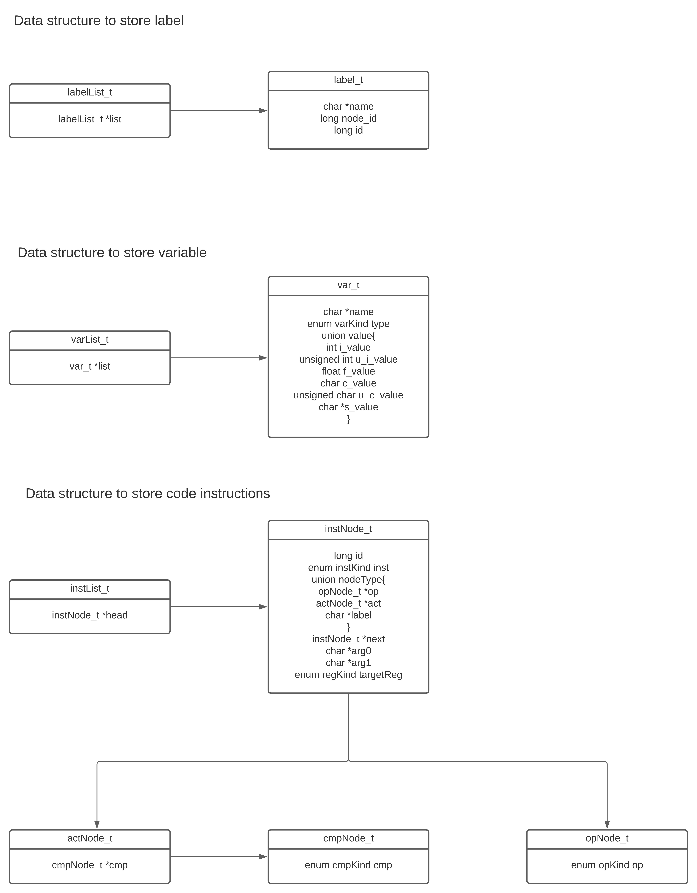

<!-- TODO:
- Changing the way I'm linking the definition for the glossary
   - Adding a convention part with all the conventions used for the project (commits, etc...). Use technical of team 3 as a model
- Define C standard libraries in the glossary
- Complete the error system part 
- Go check the functional 
- Talking about CMake -->
<br><details>
<summary><h3 id="toc"> Table of Contents <i>(Click to expand)</i></h3></summary>

- 📄 [Technical Specification](#technical-specification-document)
    - ✅ [Approvals](#approvals)
- 🌐 [1 - Overview](#1---overview)
  - 🎯 [1.1 - Purpose](#11---purpose)
    - 🏆 [1.1.1 - Goals](#111---goals)
    - 🎯 [1.1.2 - Objectives](#112---objectives)
    - 🏁 [1.1.3 - Success Criteria](#113---success-criteria)
  - 👥 [1.2 - Stakeholders](#12---stakeholders)
    - 🧑‍🤝‍🧑 [1.2.1 - Project Team](#121---project-team)
    - 🤝 [1.2.2 - Client](#122---client)
  - 🖥️ [1.3 - Usage](#13---usage)
    - 📋 [1.3.1 - Requirements](#131---requirements)
    - ⚙️ [1.3.2 - Installation](#132---installation)
      - 💻 [1.3.2.1 - Installation with Bash](#1321---installation-with-bash)
      - 🖥️ [1.3.2.2 - Installation with GitHub Desktop](#1322---installation-with-github-desktop)
    - ▶️ [1.3.3 - Running](#133---running)
  - 📏 [1.4 - Scope](#14---scope)
    - 🟢 [1.4.1 - In Scope](#141---in-scope)
    - 🔴 [1.4.2 - Out of Scope](#142---out-of-scope)
- 🗒️ [2 - Overall Description](#2---overall-description)
  - 💻 [2.1 System Environment](#21-system-environment)
    - 🖥️ [2.1.1 - Hardware](#211---hardware)
    - 🛠️ [2.1.2 - Software](#212---software)
  - 📁 [2.2 - Project Folder Structure](#22---project-folder-structure)
 <!-- - 📚 [2.3 - Conventions](#23---conventions)
    - 🖊️ [2.3.1 - Naming Conventions](#231---naming-conventions)
      - 📂 [2.3.1.1 Folders](#2311-folders)
      - 📄 [2.3.1.2 Files](#2312-files)
      - 🔤 [2.3.1.3 Variables](#2313-variables)
      - 🔠 [2.3.1.4 Constants](#2314-constants)
      - 🔄 [2.3.1.5 Functions](#2315-functions)
    - 🖋️ [2.3.2 - Formatting Conventions](#232---formatting-conventions)
      - ↩️ [2.3.2.1 - Indentation](#2321---indentation)
      - 📏 [2.3.2.2 - Line Length](#2322---line-length)
      - 📐 [2.3.2.3 - Line Breaks](#2323---line-breaks)
      - 💬 [2.3.2.4 - Comments](#2324---comments)
  - 🖥️ [2.4 - Assembly Syntax](#24---assembly-syntax)
    - 📝 [2.4.1 - Registers](#241---registers)
      - 🔢 [2.4.1.1 - Storing an immediate value into a register](#2411---storing-an-immediate-value-into-a-register)
      - 🔀 [2.4.1.2 Copying the value of a register into another register](#2412-copying-the-value-of-a-register-into-another-register)
      - 📖 [2.4.1.3 Reading the value from the memory to a register](#2413-reading-the-value-from-the-memory-to-a-register)
      - 📝 [2.4.1.4 Writing the value from a register to the memory](#2414-writing-the-value-from-a-register-to-the-memory)
    - ↗️ [2.4.2 - Jumping to a label](#242---jumping-to-a-label)
      - 🏃‍♂️ [2.4.2.1 - Jumping unconditionally](#2421---jumping-unconditionally)
      - ↪️ [2.4.2.2 - Jumping conditionally (where "cc" is a condition code)](#2422---jumping-conditionally-where-cc-is-a-condition-code)
    - 🔍 [2.4.3 - Comparing registers](#243---comparing-registers)
    - 📞 [2.4.4 - Calling a subroutine](#244---calling-a-subroutine)
    - 🏁 [2.4.5 - Returning from a subroutine](#245---returning-from-a-subroutine)
    - ➕ [2.4.6 - Arithmetic operations](#246---arithmetic-operations)
      - ➕ [2.4.6.1 - Addition](#2461---addition)
      - ➖ [2.4.6.2 - Subtraction](#2462---subtraction)
      - ✖️ [2.4.6.3 - Multiplication](#2463---multiplication)
      - ➗ [2.4.6.4 - Division](#2464---division)
    - 🧠 [2.4.7 - Logical operations](#247---logical-operations)
      - 🤝 [2.4.7.1 - Logical AND](#2471---logical-and)
      - 🤲 [2.4.7.2 - Logical OR](#2472---logical-or)
      - 💥 [2.4.7.3 - Logical XOR](#2473---logical-xor)
      - ⛔ [2.4.7.3 - Logical NOT](#2473---logical-not)
    - 💭 [2.4.8 - Comments](#248---comments)
- 📐 [3 - Software Architecture](#3---software-architecture)
  - 🖥️ [3.1 - Scraping](#31---scraping)
    - 🗂️ [3.1.1 - `scraper.c`](#311---scraperc)
    - 📄 [3.1.2 - `scraper.h`](#312---scraperh)
    - ✅ [3.1.3 - `scraper_test.c`](#313---scraper_testc)
    - 📝 [3.1.4 - `scraper_test.h`](#314---scraper_testh)
  - 🖥️ [3.2 Parsing](#32-parsing)
    - 🗂️ [3.2.1 `parser.c`](#321-parserc)
    - 📄 [3.2.2 `parser.h`](#322-parserh)
    - ✅ [3.2.3 `parser_test.c`](#323-parser_testc)
    - 📝 [3.2.4 `parser_test.h`](#324-parser_testh)
  - 🖥️ [3.3 Interpreting](#33-interpreting)
    - 🗂️ [3.3.1 `interpreter.c`](#331-interpreterc)
    - 📄 [3.3.2 `interpreter.h`](#332-interpreterh)
    - ✅ [3.3.3 `interpreter_test.c`](#333-interpreter_testc)
    - 📝 [3.3.4 `interpreter_test.h`](#334-interpreter_testh)
  - 🖥️ [3.4 Main](#34-main)
    - 🗂️ [3.4.1 `main.c`](#341-mainc)
    - 📄 [3.4.2 `main.h`](#342-mainh)
    - ✅ [3.4.3 `main_test.c`](#343-main_testc)
    - 📝 [3.4.4 `main_test.h`](#344-main_testh)
- 📚 [4 - End Matter](#4---end-matter)
  - 👥 [4.1 - Contributors](#41---contributors)
  - 📃 [4.2 - Related Documents](#42---related-documents)
  - ©️ [4.3 - License](#43---license)
  - 🔗 [4.4 - References](#44---references)
    - 🛠️ [4.4.1 - Tools](#441---tools)
    - 🔍 [4.4.2 - References](#442---references)
  - 📚 [4.5 - Glossary](#45---glossary)
  - 🔢 [4.6 - Footnotes](#46---footnotes)-->


</details>

---

# 1 - Overview

## 1.1 - Purpose

[*(Back to top)*](#toc)

### 1.1.1 - Goals

The objective of this project is to create a virtual processor and an interpreter for a customized assembly language. By utilizing C standard libraries for broad compatibility, the main aim is to develop a concise assembly language and construct a C program interpreter that can execute and validate assembly code. This solution is specifically designed for educational purposes and software developers who are keen on delving into low-level programming and processor emulation. The project seamlessly blends technical innovation with practical application, with a strong emphasis on creating a user-friendly and educational tool in the realm of computer architecture.

### 1.1.2 - Objectives

The project aims to achieve the following objectives:

1. Create a concise assembly language with an ample range of instructions.
2. Construct an interpreter that can effectively execute assembly code.
3. Construct an interpreter that can thoroughly validate assembly code for errors.
4. Design the interpreter to be user-friendly and easily accessible.
5. Ensure compatibility of the interpreter with various operating systems.

### 1.1.3 - Success criteria

The project's success will be determined by meeting the following conditions:

1. The interpreter must have the ability to execute assembly code effectively.
2. The interpreter should be compatible with the widely used operating systems.
3. All the instructions in the set must be implemented completely.

## 1.2 - Stakeholders

This project is solely intended for educational purposes and is not meant for any commercial use. The project team will assume full responsibility for the project's development, while the client will play a crucial role in providing feedback and guidance throughout the entire development process.

### 1.2.1 - Project team

| Name               | Role              | GitHub \| Linkedin                                                            |
| ------------------ | ----------------- | -------------------------------------------------------------------------- |
| Mathias Gagnepain  | Project Manager   | [GitHub](https://github.com/MathiasGagnepain) \| [Linkedin](https://www.linkedin.com/in/mathias-gagnepain-426a131b0/)            |
| Guillaume Despaux  | Program Manager   | [GitHub](https://github.com/GuillaumeDespaux) \| [Linkedin](https://www.linkedin.com/in/guillaume-despaux-084b10206/)            |
| Guillaume Deramchi | Technical Lead    | [GitHub](https://github.com/Guillaume18100)   \| [Linkedin](https://www.linkedin.com/in/guillaume-deramchi-a45116293/)           |
| Paul Nowak         | Software Engineer | [GitHub](https://github.com/PaulNowak36)      \| [Linkedin](https://www.linkedin.com/in/paul-nowak-0757a61a7/)                   |
| Maxime Caron       | Software Engineer | [GitHub](https://github.com/MaximeAlgosup)    \| [Linkedin](https://www.linkedin.com/in/maxime-caron-dev/)                       |
| Enzo Guillouche    | Quality Assurance | [GitHub](https://github.com/EnzoGuillouche)   \| [Linkedin](https://www.linkedin.com/in/enzo-g-b62114293/)                       |


### 1.2.2 - Client

| Name             | Role                 | Contact                                                         |
| ---------------- | -------------------- | --------------------------------------------------------------- |
| ALGOSUP          | Client               | [Website](https://www.algosup.com/)                             |
| Franck JEANNIN   | ALGOSUP's Co-Founder | [LinkedIn](https://www.linkedin.com/in/franck-jeannin/)         |
| Eric LARCHEVEQUE | ALGOSUP's Co-Founder | [LinkedIn](https://www.linkedin.com/in/ericlarch/)              |
| Natacha BOEZ     | ALGOSUP's Co-Founder | [LinkedIn](https://www.linkedin.com/in/natacha-boez-913a33167/) |

## 1.3 - Usage

The interpreter is designed to provide a user-friendly and easy-to-use experience. It is developed to integrate with popular operating systems and can execute assembly code while also checking for errors. Additionally, the interpreter can display the output of the assembly code. Below are the instructions for installing and running the interpreter.

### 1.3.1 - Requirements

To run your custom assembly code, you will need to install the following dependencies:

- [VS Code](https://code.visualstudio.com/download) - Visual Studio Code is a free source-code editor made by Microsoft for Windows, Linux and macOS.
- [C/C++ for Visual Studio Code](https://marketplace.visualstudio.com/items?itemName=ms-vscode.cpptools) - C/C++ for Visual Studio Code is an extension for VS Code that provides IntelliSense, debugging, and code browsing support for C and C++ code.
- [GCC](https://gcc.gnu.org/install/) - GCC, the GNU Compiler Collection, is a free collection of compilers for C, C++, Objective-C, Fortran, Ada, Go, and D programming languages.
- [CMake](https://earthly.dev/blog/installandrun-cmake-on-windows/) - CMake is an open-source, cross-platform family of tools designed to build, test, and package software by managing the compilation process across different systems.

The software is developed using the C99 version of the C language.

### 1.3.2 - Installation

To install the interpreter, you will need to follow these steps:

1. Clone the repository on your local machine.

#### 1.3.2.1 - Installation with Bash

Open a terminal and run the following commands:

If you are on macOS:

```bash
git clone https://github.com/algosup/2023-2024-project-3-virtual-processor-team-2.git
cd 2023-2024-project-3-virtual-processor-team-2
```

#### 1.3.2.2 - Installation with GitHub Desktop

Download and open GitHub Desktop and click on `File > Clone Repository`. Select the URL tab and enter the following URL:

```bash
https://github.com/algosup/2023-2024-project-3-virtual-processor-team-2.git
```

Then click on `Clone`.

### 1.3.3 - Running

To run the interpreter, you will need to follow these steps:

1. Create a bin folder.
2. Compile it with CMake (using the CMakeLists.txt file).
3. Add the interpreter to your computer path.

## 1.4 - Scope

[*(Back to top)*](#toc)

### 1.4.1 - In scope

The project encompasses the following functionalities:

1. Fundamental assembly language with a concise set of instructions.
2. An interpreter that can execute assembly code.
3. An interpreter that can check errors in the assembly.
4. A user-friendly usage.
5. Compatibility with prevalent operating systems.

### 1.4.2 - Out of scope

The following features will be excluded from the project:

1. Sophisticated assembly language with a intricate array of instructions.
2. Graphical user interface.
3. Debugging tools.
4. Compatibility with specific hardware configurations.
5. Compatibility with other programming languages.
6. Real-time performance analysis.
7. Advanced memory management.

---

# 2 - Overall description

## 2.1 System environment


### 2.1.1 - Hardware

The interpreter is designed to be compatible with the most prevalent hardware configurations and will undergo testing on the hardware listed below:

| Specification    | Lenovo ThinkBook 14  | Lenovo ThinkBook 14  | Lenovo ThinkPad 2023 | Apple MacBook Air M1 2020 | Apple MacBook Air M1 2020 |
| ---------------- | -------------------- | -------------------- | -------------------- | ------------------------- | ------------------------- |
| Processor        | Intel Core I7-1065G7 | Intel Core i7-1165G7 | Intel Core i7-1355U  | Apple Silicon M1          | Apple Silicon M1          |
| RAM         | 16GB                 | 16 GB                | 16GB                 | 8 GB                      | 8 GB                      |
| Operating System | Windows 11 Pro       | Windows 11 Pro       | Windows 11 Pro       | macOS Ventura             | macOS Sonoma              |

### 2.1.2 - Software

The interpreter will undergo compatibility testing on the most widely used operating systems, including:

| Operating System | Windows 11 Pro | macOS Ventura | macOS Sonoma |
| ---------------- | -------------- | ------------- | ------------ |
| Version          | 22H2           | 13.0          | 14.3         |

## 2.2 - Project folder structure

The folder structure for the project will be as follows:


``` folder
├── 2023-2024-project-3-virtual-processor-team-2 (root)
|   ├── documents
|   |   ├── communications
|   |   |   ├── minutes_of_meeting_01_16_2024.pdf
|   |   ├── functional
|   |   |   ├── 2023_2024_project_3_virtual_processor.pdf
|   |   |   ├── at2_assembly_language_documentation.md
|   |   |   ├── functional_specification_document_template.md
|   |   ├── images
|   |   |   ├── functional_images
|   |   |   |   ├── interpreter_mockup.png
|   |   |   |   ├── virtual_terminal.png
|   |   |   ├── qa_images
|   |   |   |   ├── test_case_pattern.png
|   |   |   |   ├── test_report_pattern.png
|   |   |   ├── technical_images
|   |   |   |   ├── state_diagram_parser_c.jpg
|   |   |   |   ├── archi_interpreter_diagram.jpg
|   |   |   |   ├── data_structure_diagram.jpg
|   |   ├── management
|   |   |   ├── weekly_reports
|   |   |   |   ├── cumulative.md
|   |   |   |   ├── week_1.md
|   |   |   |   ├── week_2.md
|   |   |   |   ├── week_3.md
|   |   |   |   ├── week_4.md
|   |   |   |   ├── week_5.md
|   |   |   |   ├── week_6.md
|   |   |   |   ├── week_7.md
|   |   |   |   ├── week_8.md
|   |   |   ├── management_artifact.md
|   |   ├── qa
|   |   |   ├── code_documentation_template.md
|   |   |   ├── meetings_reports.md
|   |   |   ├── qa_collaboration.md
|   |   |   ├── test_cases.md
|   |   |   ├── test_plan.md
|   |   |   ├── test_reports.md
|   |   ├── technical
|   |   |   ├── roadmap.md
|   |   |   ├── technical.md
|   ├── .gitignore
|   ├── CODE_OF_CONDUCT.md
|   ├── CONTRIBUTING.md
|   ├── LICENSE
|   ├── README.md
|   ├── SECURITY.md
```

## III. Virtual processor specifications 

### 3.1 - Virtual processor

#### Processor details 
- 16-bit processor
- 8 registers (including 1 dedicated to the clock)

#### Processor capabilities
- Basic arithmetic operations
- Input/output operations

#### Processor runner
- Runner for a **[processor](#processor)**, with common functionalities of small and limited 16 bits processor.

### 3.2 - Interpreter

#### Interpreter functions


---

- **Parser** <br>The parser is the first part of the interpreter: 
   - Reads input files.
   - Analyses the instructions.
   - Put the instructions in an algorithmic structure.


---

- **Builder**<br>The builder is the second part of the interpreter:
   - Reads the algorithmic structure.
   - Replaces some parts to make them readable for the Virtual processor.

---

- **Virtual processor**<br>The last part of the interpreter:
   - Executes the program regarding the algorithmic structure.

---

- **Execution flow control**: The interpreter manages the flow of execution based on control instructions like loops, conditional statements, and jumps.
- **Error handling**: Includes robust error detection and reporting mechanisms to handle syntax and logical errors in the AT2 code.

#### Integration with virtual processor
- **Execution**: The interpreter works closely with the virtual processor to ensure smooth execution of AT2 programs, simulating a real processor's behavior.
- **Resource management**: It efficiently manages the processor's resources, such as memory and registers, during the execution of AT2 code.

#### User interaction
- **Interactive mode**: The interpreter allows for users to enter and execute AT2 instructions one at a time, which is beneficial for learning and debugging.

### 3.3 - Data structures


---

## IV. AT2 language specifications
Our new Assembly language will be named AT2 (Assembly Team 2). Its extension will be .aop (Assembly Operation Processor). 

### 4.1 - **[Instruction set](#instruction-set)**
- **Arithmetic and [bitwise operations](#bitwise-operation)**:
  - `add`, `+`: Addition operation. Adds values of two **[registers](#register)** or a register and an immediate value.
  - `sub`, `-`: Subtraction operation. Subtracts the second **[operand](#operand)** from the first.
  - `div`, `/`: Division operation. Divides the first operand by the second.
  - `mul`, `*`: Multiplication operation. Multiplies two operands.
  - `mod`, `%`: Modulus operation. Computes the remainder of division of two operands.
  - `shr`, `>>`: Right shift operation. Shifts bits of the operand to the right.
  - `shl`, `<<`: Left shift operation. Shifts bits of the operand to the left.
  - `or`, `|`: Bitwise OR operation. Performs bitwise OR on two operands.
  - `and`, `&`: Bitwise AND operation. Performs bitwise AND on two operands.
  - `not`, `!`: Bitwise NOT operation. Inverts the bits of the operand.
  - `xor`, `^`: Bitwise XOR operation. Performs bitwise exclusive OR on two operands.

#### Comparison types (`cmpKind`)
- **Logical operations for conditional processing**:
  - `or`, `||`: Logical OR comparison. Evaluates to true if either of the operands is true.
  - `and`, `&&`: Logical AND comparison. Evaluates to true only if both operands are true.
  - `not`, `!`: Logical NOT comparison. Inverts the truth value of the operand.
  - `xor`, `^`: Logical XOR comparison. Evaluates to true if operands are different.

#### Action types (`actionKind`)
- **Control flow instructions**:
  - `if`: Conditional execution. Executes the AT2 language following block if the condition is true.
  - `else`: Else block for a conditional. Executes if the `if` condition is false.
  - `loop`: Begins a loop structure. Continues execution until a condition is met.
  - `exit`: Marks the end of a control flow block, like the end of an if-else or loop.
  - `mov`: Move operation. Transfers data from one register to another or to/from memory.
  - `jmp`, `goto`: Unconditional jump. Alters the flow of execution to a new address.
  - `call`: Calls a subroutine. Jumps to subroutine address and maintains return address.
  - `ret`: Return from subroutine. Returns control to the calling function.
  - `clk`: Retrieves the current value of the system clock.

#### Register types (`regKind`)
- **Register enumeration for the virtual processor**:
  - `rg0`, `rg1`, ..., `rg6`: Enumeration of registers available in the virtual processor. These registers are used for storing temporary data, performing operations, and maintaining state within the processor.  
  - `rg7`: Dedicated for the clock.

#### Variables declarations
  - `var name, value` will be the convention for a variable declaration.
#### Function declaration
  - `lab name` will be the convention for a function declaration.
#### File inclusion
  - `get "filename.aop"` will be the convention for a file inclusion.


### 4.2 - Syntax and conventions

The **[syntax](#syntax)** and conventions of the AT2 language are designed to be intuitive and aligned with standard practices in Assembly language programming. This section outlines the fundamental syntax rules for instructions, registers, **[memory addressing](#memory-addressing1)**, and data types.

#### Instruction syntax
- **Format**: Instructions generally follow the format of `instruction arg0, arg1`. Operands can be registers, immediate values, or memory addresses.
- **Example**: `+ rg0, rg1` - This instruction adds the content of `rg1` to `rg0`.

#### Register syntax
- **Usage**: Registers are referred to by their names, such as `rg0`, `rg1`, etc.
- **Context**: Used as operands in instructions for operations like data movement, arithmetic operations, etc.

#### Data types
- **Immediate values**: Constants or literals directly used in instructions. For example, `+ rg0, 5` adds the value `5` to the content of `rg0`.
- **Binary and hexadecimal support**: The language supports both **[binary](#binary)** and **[hexadecimal](#hexadecimal)**  literals for ease of low-level programming. However, you need to specify the type of your literal. For instance, `0b` for binary and `0x` for hexadecimal at the beginning.
- **Strings**: Strings should be defined with double quotes: `"string"`.
- **Characters**: Characters should be defined with simple quotes: `'q'`.

#### Conventions
- **Case sensitivity**: All instructions and register names must be used in the correct case:
   - Each functions name will be written in snake_case.

   - Variable names will be written in camelCase.

   - All variable will be written at the same place.

   - All #define will be written in SNAKE_CASE and in uppercase.

   - All #define will be written at the same place.
- **Whitespace**: Whitespace is used to separate the elements of an instruction but is otherwise not significant.
- **Comments**: Comments start with `//` for one-line comments, the same comments convention as C language. For example: `// This is a comment`

---

## V. Development tools

### 5.1 - Debugger
- **Capabilities**: The debugger will allow users to step through their code, inspect the contents of registers and memory, and set breakpoints.
- **User interface**: The debugger will have a user-friendly interface, displaying understandable information.
- **Integration with builder**: A good integration with the builder ensures that users can quickly identify and fix issues in their code.

<!-- I need to clarify this with the software engineers-->
### 5.2 - Code organization
- **Header files (`.h`)**: The prototype and comments of the functions are in the header files. All enumerations and structures/typedefs are also defined in these files. This approach helps in providing a clear interface for each module.
- **Implementation files (`.c`)**: The function definitions (implementations) are in the `.c` files. Comments explaining the implementation details should also be included in these files. This separation of interface and implementation facilitates maintainability and readability of the code.

### 5.3 - Error system
- Error system
	- Kind of error
		- More or less details
	- Line number
	- File name

---

## VI. Testing and validation

While a detailed testing document will be provided separately by the Quality Assurance, this section briefly outlines the general approach to testing and validation for the virtual processor and AT2 language.

### General testing 
- Testing encompasses a range of methods, from unit tests for individual components to integration tests that assess the whole system.

### Coordination with QA
- The development team will collaborate with the Quality Assurance team to align testing strategies and ensure complete coverage of all functionalities.
- Feedback from QA testing will be integral to the iterative development process, guiding enhancements and refinements in the virtual processor and the AT2 language.

### Reference to QA document
- For detailed testing procedures, methodologies, and specific test cases, refer to the dedicated **[test plan](../QA/test_plan.md)**.

---

## VII. Risks and challenges

### 7.1 - Risks 
- There's a risk of underestimating the development time and resources needed.

- The interpreter might not perform optimally, leading to slow execution of assembly code, which can frustrate users.

- The interpreter may face compatibility issues on different operating systems or hardware configurations.


- There's a possibility of misinterpretation or bugs in how assembly instructions are processed, leading to incorrect program behavior.

- Inadequate documentation and learning resources can hinder user understanding and adoption.

- The interpreter may not be scalable or flexible enough to accommodate future enhancements or changes in technology.


### 7.2 - Challenges
- Creating a comprehensive and functional 16-bit processor architecture from scratch.

- Ensuring the virtual processor accurately simulates the behavior of a typical 16-bit processor.

- Defining an intuitive yet powerful AT2 language suited for a 16-bit processor.

- Ensuring the interpreter executes the AT2 code efficiently.

- Optimizing the execution speed to provide a smooth development and testing experience for users.

- Writing comprehensive documentation that clearly explains how to use the interpreter and write code in the new AT2 language.

- Keeping documentation aligned with updates and enhancements to the interpreter and AT2 language.

- Actively incorporating user insights and suggestions into ongoing development for continuous improvement.

---

## VIII. Documentation

### Documentation strategy
- **Comprehensive coverage**: All aspects of the project, from design and development to testing and deployment, will be thoroughly documented. This includes technical specifications, user manuals, and developer guides.
- **Clarity and accessibility**: Documentation will be written in clear, concise language to ensure it is accessible to all team members and stakeholders, regardless of their technical background.

### Types of documentation
- **Technical specifications**: Details the architecture of the virtual processor, the AT2 language's syntax and semantics, and the development tools, crucial for guiding the project's implementation.

- **Functional specifications**: Provides an overview of the intended functionality and user requirements of the virtual processor and AT2 language, essential for aligning the development with user needs.

- **QA testing document**: This document outlines testing methodologies, specific test cases, and results, ensuring the reliability and robustness of the final product.

- **Weekly reports**: Regular updates on the project's progress, challenges faced, and milestones achieved. These reports keep all team members informed and aligned with the project's current status and future direction.

### Version control and updates
- **Regular updates**: Documentation will be regularly updated to reflect the latest changes and additions to the project.
- **Version control**: All documentation will be maintained under version control, ensuring that changes are tracked, and historical versions are accessible.

### Collaboration and review
- **Team involvement**: All team members will be encouraged to contribute to and review documentation to ensure accuracy and completeness.
- **Continuous improvement**: Feedback on documentation will be actively sought and used to make continuous improvements, ensuring that the documentation remains relevant and useful.

---

## IX. Appendices

### 9.1 - References

1. "Assembly language." Gentoo Wiki. Overview and resources related to Assembly language programming. Available at: [wiki.gentoo.org](https://wiki.gentoo.org/wiki/Assembly_language)
2. Streanga, L. "Assembler Project." GitHub repository. An Assembler for converting Assembly language for a virtual processor into machine code. Available at: [github.com/lucas-streanga/Assembler-Project](https://github.com/lucas-streanga/Assembler-Project)
3. Edu4Java, "Compiler, interpreter and virtual machine.", educational website. Provides tutorials and explanations on compilers, interpreters, and virtual machines. Available at: [edu4java.com/en/concepts/compiler-interpreter-virtual-machine](http://www.edu4java.com/en/concepts/compiler-interpreter-virtual-machine.html)


## 9.2 - Glossary

| Term             | Definition |
|------------------|------------|
| **Assembly language** | A low-level programming language used to write instructions that a processor can understand directly. [↩]() |
| **Binary**      | A base-2 numerical system used in digital electronics and computing. [↩]() |
| **Bitwise operation** | An operation that directly manipulates bits. [↩]() |
| **C Standard Libraries** | A collection of header files and libraries in the C programming language, providing common functions for tasks like I/O operations, string handling, mathematical computations, and memory management. Defined by the ANSI C standard. [↩]() |
| **Debugger**    | A tool used to test and debug programs. [↩]() |
| **Hexadecimal** | A base-16 number system used in computing. [↩]() |
| **Instruction set** | The collection of instructions that a processor can execute. [↩]() |
| **Interpreter** | A program that executes instructions written in a programming or scripting language without requiring them to be compiled into machine language. [↩]() |
| **Machine code** | The lowest-level programming language, consisting of binary code. [↩]() |
| **Memory addressing** | The method by which a processor can access data stored in memory. [↩]() |
| **Opcode**      | The part of a machine language instruction that specifies the operation. [↩]() |
| **Operand**     | The part of a computer instruction that specifies what data is to be operated on. [↩]() |
| **Processor**   | The component that performs the instructions of a computer program. [↩]() |
| **RAM (Random Access Memory)** | Memory that can be accessed randomly, used for storing working data and machine code. [↩]() |
| **Register**    | A small, quickly accessible storage location in a processor. [↩]() |
| **ROM (Read-Only Memory)** | Non-volatile memory used in computers and other devices. [↩]() |
| **Syntax**      | The rules defining the structure of correctly formatted programs in a language. [↩]() |
| **Virtual processor** | A software-based emulation of a processor. [↩]() |

---

